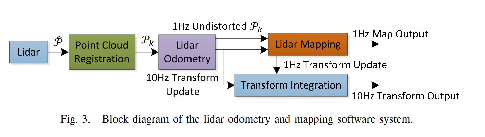
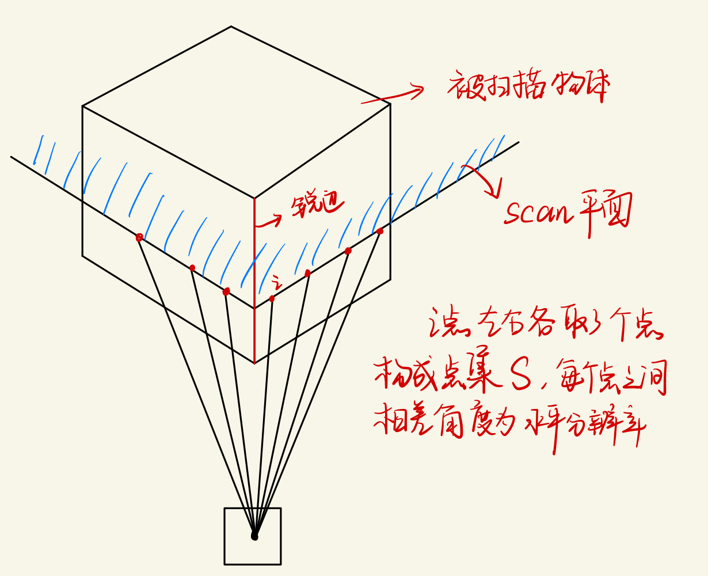
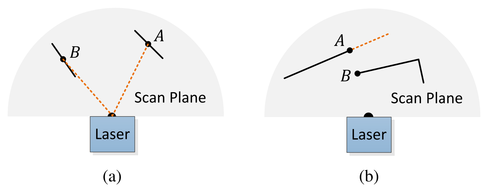
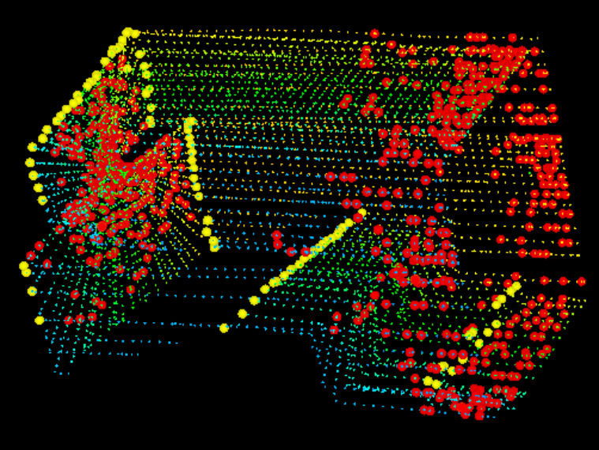
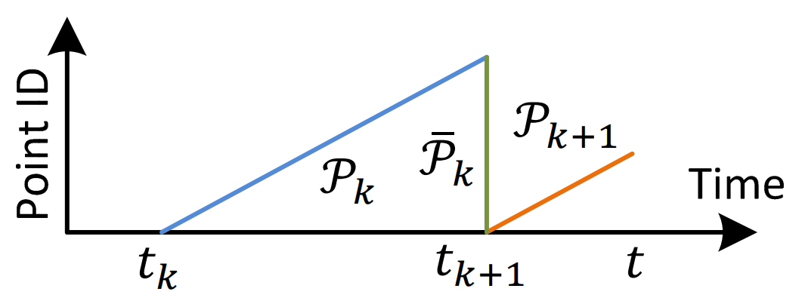
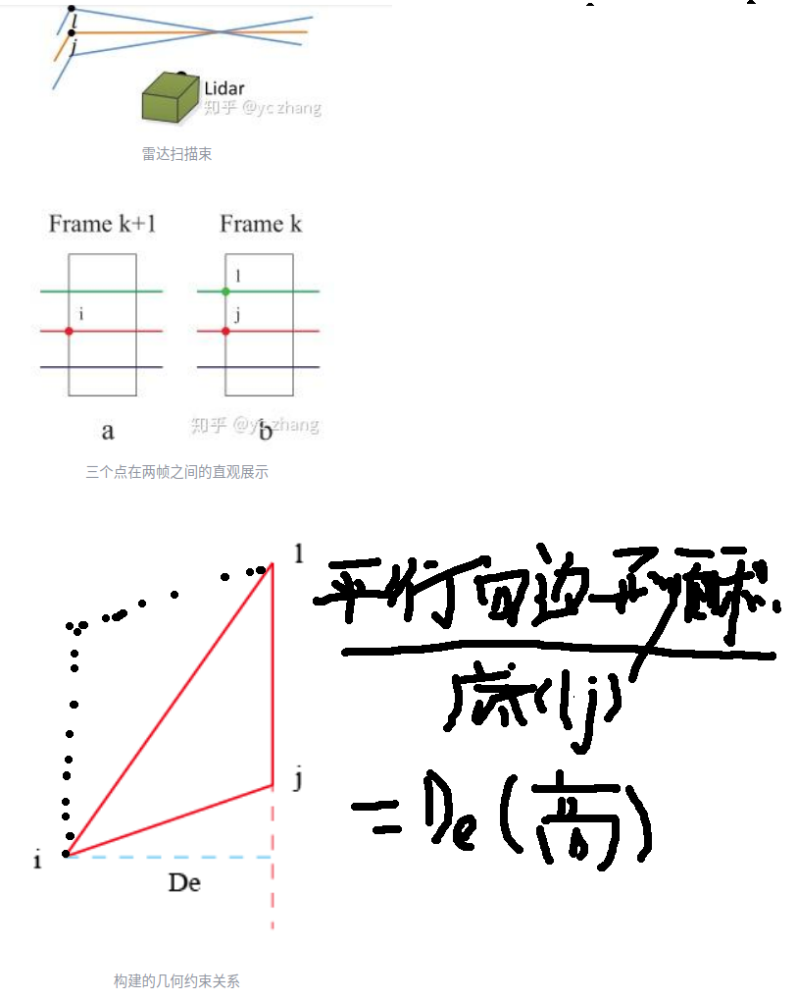
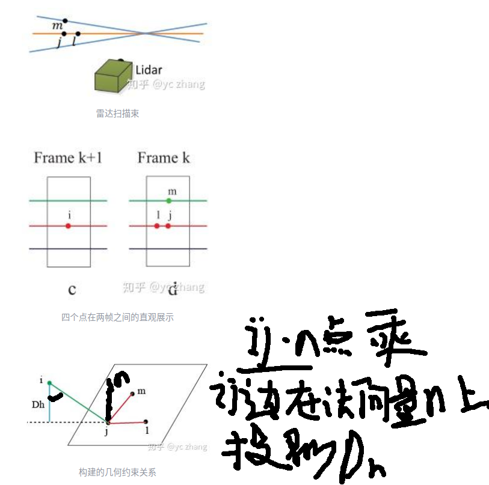
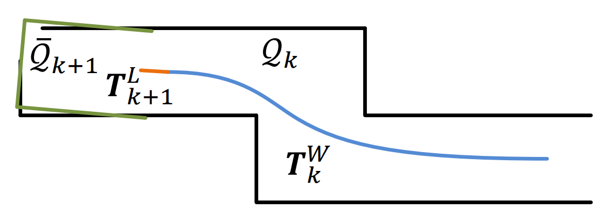
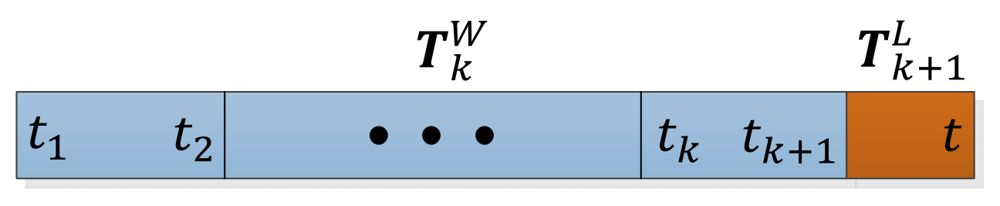

# 
 my loam notebool 

## LOAM( Lidar Odometry and Mapping )   
本文的核心主要在于两个部分：特征提取（Lidar Registration）和里程计解算（Odometry and Mapping）。当提取出特征后，通过高频率的里程计（Transform output）实现粗定位和低频率的里程计（Map output）实现精定位。 
     
### 特征提取（Lidar Registration）   
我们选择位于边缘（sharp edges）和平面片（planar surface patches）上的特征点【选择角点和面点作为特征点】。定义 i为激光雷达点云$P_i$中的一点，设S为激光雷达扫描仪在同一次扫描中返回i的连续点的集合，由于激光扫描仪以 CW 或 CCW 顺序【CW 为顺时针，CCW 逆时针，目前的 lidar 大部分是顺时针旋转】返回生成点，S中在i左右两侧各有一半的点，其中每两个点之间的间隔为0.25度，定义一个术语以评估局部曲面的平滑度（smoothness）【也可以叫做曲率】
$$c = \frac{1}{\left| S \right| \cdot \left\| X_{(k, i)}^{L} \right\|} \left\| \sum_{j \in S, j \ne i}{\left( X_{(k, i)}^{L} - X_{(k, j)}^{L} \right)} \right\| \quad\quad\quad\quad\quad (1)$$
其中$X_{(k, i)}^{L}$指的是L（雷达）坐标系下第k次扫描的点云$P_k$中的第i个点     
通过归一化矢量和的模来判断点i的类型。边缘点的矢量和的模一般较大，矢量和不为零向量，而对应平面点的矢量和的模一般较小，矢量和为零向量。     
j就是在i周围的点。曲率 = （当前点到其附近点的距离差 / 当前点的值 ) 的总和再求平均 = 平均的距离差     
    

扫描中的点根据c值【曲率】进行排序，然后选择具有最大c值（称为边缘点）和最小c值（称为平面点）的特征点。为了在环境中均匀分布特征点，我们将一次扫描分为四个相同的子区域【代码中是 6 等分】。每个子区域最多可提供 2 个边缘点和 4 个平面点。仅当点 i的c值大于或小于阈值且所选点的数量不超过最大值时，才可以将点i选择为边缘点或平面点。             
     
此外还需要舍弃掉不可靠的平行点（所在平面和激光束平行）和遮挡点（某点与左右相邻两个点的距离过大）    
总之，特征点被选择为从最大曲率c值开始的边缘点和从最小曲率c值开始的平面点，如果一个点要被选择，
- 选择的边缘点或平面点的数量不能超过子区域的最大值，并且
- 它的周围点都没有被选择，并且
- 它不能在大致平行于激光束的平面上，或位于遮挡区域的边界上。
从走廊场景中提取特征点的实例如图 5 所示。边缘点和平面点分别用黄色和红色标注。  从一条走廊的激光雷达云中提取边缘点（黄色）和平面点（红色）的例子。同时，激光雷达以 0.5m/s的速度向图像左侧墙体移动，导致墙体运动变形。

         

### 特征关联算法    

里程计 odometry 算法在一个扫描帧（sweep）中估计激光雷达的运动。将点云重新投影到扫描的末尾。蓝色线段表示第k次扫描期间感知到的点云$P_k$。在第k次扫描结束时，将$P_k$重新投影到时间戳$t_{k+1}$以获得 $\overline{P}_k$（绿色线段）。然后，在第 k+1次扫描期间， 
$\overline{P}_k$和新感知的点云 $P_{k+1}$（橙色线段）一起用于估计激光雷达运动。     
      

下图j是距离特征点i最近的点，位于$P_k$中。橙色线条表示j的同一条扫描线，蓝色线条表示相邻的两次连续扫描线。为了找到下图中的边线对应关系，我们在蓝色线上找到另一个点l，这样的目的是防止i,j,l三点共线而无法构成三角形，根据找到的特征点的对应关系，现在我们导出表达式来计算从特征点到其对应关系的距离。在下一节中，我们将通过最小化特征点的总距离来恢复激光雷达的运动。
     
我们从边缘点开始。对于点$i \in \tilde{\mathcal{E}}_{k+1}$,因为点j和点l在一条直线上，$j, l \in \overline{\mathcal{P}}_{k}$,则点到直线的距离可表示为：   
$$
d_{\mathcal{E}} = \frac{\left| ( \tilde{\boldsymbol{X}}_{(k + 1, i)}^{L} - \overline{\boldsymbol{X}}_{(k, j)}^{L} ) \times ( \tilde{\boldsymbol{X}}_{(k + 1, i)}^{L} - \overline{\boldsymbol{X}}_{(k, l)}^{L} ) \right|} {\left| \overline{\boldsymbol{X}}_{(k, j)}^{L} - \overline{\boldsymbol{X}}_{(k, l)}^{L} \right|} \quad\quad\quad\quad\quad (2)
$$       
其中$\tilde{\boldsymbol{X}}_{(k+1, i)}^{L}$,$\overline{\boldsymbol{X}}_{(k, j)}^{L}$和$\overline{\boldsymbol{X}}_{(k, l)}^{L}$表示点i、j 和l的坐标，叉乘表示向量组成的平行四边形面积，面积/边 = 高。这里的高就是距离。为了获取两帧间的数据关联情况，应尽可能的让点到直线的距离最小。

下图j是距离特征点i最近的点，我们在橙色和蓝色线上分别找到另外两个点l和m，对于点$i \in \tilde{\mathcal{H}}_{k+1}$,因为点i，j，k组成平面且$j, l, m \in \overline{\mathcal{P}}_{k}$,则点到平面的距离为：     
$$
d_{\mathcal{E}} = \frac{
\begin{vmatrix}
( \tilde{\boldsymbol{X}}_{(k + 1, i)}^{L} - \overline{\boldsymbol{X}}_{(k, j)}^{L} ) \\
( ( \overline{\boldsymbol{X}}_{(k, j)}^{L} - \overline{\boldsymbol{X}}_{(k, l)}^{L} ) \times ( \overline{\boldsymbol{X}}_{(k, j)}^{L} - \overline{\boldsymbol{X}}_{(k, m)}^{L} ) )
\end{vmatrix}
} {\left| ( \overline{\boldsymbol{X}}_{(k, j)}^{L} - \overline{\boldsymbol{X}}_{(k, l)}^{L} ) \times ( \overline{\boldsymbol{X}}_{(k, j)}^{L} - \overline{\boldsymbol{X}}_{(k, m)}^{L} ) \right|} \quad\quad\quad\quad\quad (3)
$$

为了获取两帧间的数据关联情况，应尽可能的让点到平面的距离最小（相当于让向量 ij 到平面法向量 n 的投影的模长最小）      

### 运动状态估计     
激光雷达在扫描的过程中以恒定的角速度和线速度进行运动建模。这允许我们在扫描中对在不同时间接收到的点进行线性插值计算姿势变换。让t作为当前时间戳，记住$t_{k+1}$表示第k+1次开始时间，设$\boldsymbol{T}_{k+1}^{L}$为$\left[t_{k+1}, t\right]$之间的激光雷达位姿变化，其中$\boldsymbol{T}_{k+1}^{L} = \left[t_{x}, t_{y}, t_{z}, \theta_{x}, \theta_{y}, \theta_{z}\right]^{T}$表示激光雷达的刚体运动，给定一个点i，且$i \in \mathcal{P}_{k+1}$，$t_i$为点i的时间戳，让$\boldsymbol{T}_{(k+1, i)}^{L}$作为点i在区间$\left[t_{k+1}, t_{i}\right]$的姿态变化     
$$
\boldsymbol{T}_{(k+1, i)}^{L} = \frac{t_i - t_{k + 1}}{t - t_{k + 1}} \boldsymbol{T}_{k+1}^{L} \quad\quad\quad\quad\quad (4)
$$     
**点的运动状态补偿**：就是激光扫描一圈的同时，用线性插值来补偿每个点在运动过程中可能产生的漂移。计算第 k+1 次 sweep 期间的一个点的位姿。    
$\mathcal{E}_{k+1}$和$\mathcal{H}_{k+1}$是从$\mathcal{P}_{k+1}$中提取的边缘点集和平面点集，而$\tilde{\mathcal{E}}_{k+1}$和$\tilde{\mathcal{H}}_{k+1}$是重新投影开始的点集，为了能得到激光雷达的运动状态：
$$
\boldsymbol{X}_{(k + 1, i)}^{L} = \boldsymbol{R}\tilde{\boldsymbol{X}}_{(k + 1, i)}^{L} + \boldsymbol{T}_{(k+1, i)}^{L}(1:3) \quad\quad\quad\quad\quad (5)
$$
其中$\boldsymbol{X}_{(k+1, i)}^{L}$是点i在点集$\mathcal{E}_{k+1}$和$\mathcal{H}_{k+1}$坐标,$\tilde{\boldsymbol{X}}_{(k+1, i)}^{L}$是点i在$\tilde{\mathcal{E}}_{k+1}$和$\tilde{\mathcal{H}}_{k+1}$点集的坐标    
结合公式（2）、（4）和（5），可以得到点到边缘线的几何关系：
$$
f_{\mathcal{E}}(\boldsymbol{X}_{(k + 1, i)}^{L}, \boldsymbol{T}_{k+1}^{L}) = d_{\mathcal{E}}, i \in \mathcal{E}_{k + 1} \quad\quad\quad\quad\quad (9)
$$     
结合公式（3）、（4）和（5），可以得到点到平面的几何关系：
$$
f_{\mathcal{H}}(\boldsymbol{X}_{(k + 1, i)}^{L}, \boldsymbol{T}_{k+1}^{L}) = d_{\mathcal{H}}, i \in \mathcal{H}_{k + 1} \quad\quad\quad\quad\quad (10)
$$      
根据公式(9)和(10)，可以使用最小二乘算法，，将向零最小化d
$$
\boldsymbol{f}(\boldsymbol{T}_{k+1}^{L}) = \boldsymbol{d} \quad\quad\quad\quad\quad (11)
$$
也可以通过非线性迭代求解【列文伯格-马夸尔特方法】
$$
\boldsymbol{T}_{k+1}^{L} \leftarrow \boldsymbol{T}_{k+1}^{L} - (\mathbf{J}^{T}\mathbf{J} + \lambda diag(\mathbf{J}^{T}\mathbf{J}))^{-1}\mathbf{J}^{T}\boldsymbol{d} \quad\quad\quad\quad\quad (12)
$$   
其中，f是关于$\boldsymbol{T}_{k+1}^{L}$的雅可比矩阵J，表示为$\mathbf{J}=\partial f / \partial \boldsymbol{T}_{k+1}^{L}$,$\lambda$是最小二乘的系数。

### 地图构建算法      
如下图是 **mapping 过程**的图示。蓝色曲线表示地图上的激光雷达姿态$\boldsymbol{T}_{k}^{W}$，由第k次扫描的 mapping 算法生成。橙色曲线表示第k+1次扫描期间由里程计算法计算的激光雷达运动 $\boldsymbol{T}_{k+1}^{L}$ 。使用 $\boldsymbol{T}_{k}^{W}$和 $\boldsymbol{T}_{k+1}^{L}$将里程计算法发布的去畸变后的点云投影到地图上，表示为 $\overline{\mathcal{Q}}_{k+1}$（绿色线段），并与地图上的现有的点云 $\mathcal{Q}_{k}$（黑色线段）进行匹配。为最新帧投影到开始时的点云。里程计得到的位姿只能作为最后建图的初值，从图中绿色线段就可以看出存在较大的误差，LOAM中是通过采用 scan-map 的匹配优化$\boldsymbol{T}_{k+1}^{W}$，至于 $\boldsymbol{T}_{k}^{W}$是通过第一帧作为世界坐标，所有相对运动（位姿） $\boldsymbol{T}_{k}^{L}$累乘即可得到。    
      
如下图是**位姿变换的集成**。蓝色区域显示了 mapping 算法中的激光雷达位姿$\boldsymbol{T}_{k}^{W}$，每次扫描生成一次。橙色区域是当前扫描范围内的激光雷达运动$\boldsymbol{T}_{k+1}^L$，由里程计 odometry 算法计算而来。激光雷达的运动估计是两种变换的组合，频率与$\boldsymbol{T}_{k+1}^L$ 相同。     
 