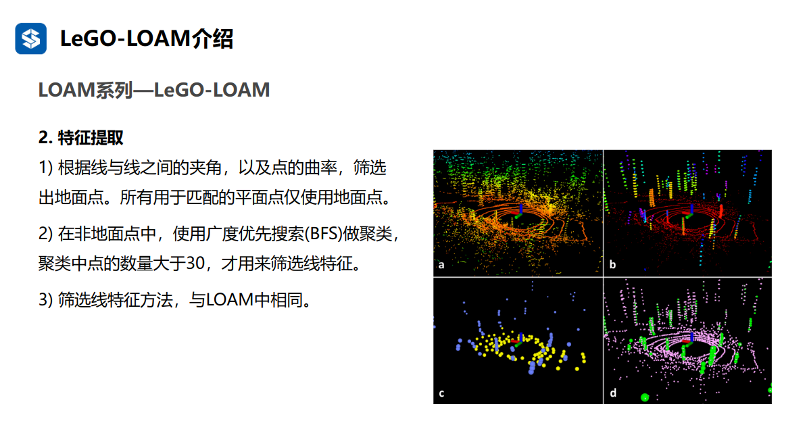

# <center> my loam notebool </center>

## LOAM( Lidar Odometry and Mapping )   
本文的核心主要在于两个部分：特征提取（Lidar Registration）和里程计解算（Odometry and Mapping）。当提取出特征后，通过高频率的里程计（Transform output）实现粗定位和低频率的里程计（Map output）实现精定位。 
     
### 特征提取（Lidar Registration）   
我们选择位于边缘（sharp edges）和平面片（planar surface patches）上的特征点【选择角点和面点作为特征点】。定义 i为激光雷达点云$P_i$中的一点，设S为激光雷达扫描仪在同一次扫描中返回i的连续点的集合，由于激光扫描仪以 CW 或 CCW 顺序【CW 为顺时针，CCW 逆时针，目前的 lidar 大部分是顺时针旋转】返回生成点，S中在i左右两侧各有一半的点，其中每两个点之间的间隔为0.25度，定义一个术语以评估局部曲面的平滑度（smoothness）【也可以叫做曲率】
$$c = \frac{1}{\left| S \right| \cdot \left\| X_{(k, i)}^{L} \right\|} \left\| \sum_{j \in S, j \ne i}{\left( X_{(k, i)}^{L} - X_{(k, j)}^{L} \right)} \right\| \quad\quad\quad\quad\quad (1)$$
其中$X_{(k, i)}^{L}$指的是L（雷达）坐标系下第k次扫描的点云$P_k$中的第i个点
计算曲率还是与代码有区别的，代码在文件[scanRegistration.cpp](./A_LOAM_Detailed_Comments/src/scanRegistration.cpp)中laserCloudHandler函数里面
```C++
// 计算每一个点的曲率，这里的laserCloud是有序的点云，故可以直接这样计算（论文中说对每条线扫scan计算曲率）
// 但是在每条scan的交界处计算得到的曲率是不准确的，这可通过scanStartInd[i]、scanEndInd[i]来选取
//i从5开始 ，终点是倒数 cloudSize - 5
for (int i = 5; i < cloudSize - 5; i++)
{ 
    float diffX = laserCloud->points[i - 5].x + laserCloud->points[i - 4].x + laserCloud->points[i - 3].x + laserCloud->points[i - 2].x + laserCloud->points[i - 1].x - 10 * laserCloud->points[i].x + laserCloud->points[i + 1].x + laserCloud->points[i + 2].x + laserCloud->points[i + 3].x + laserCloud->points[i + 4].x + laserCloud->points[i + 5].x;
    float diffY = laserCloud->points[i - 5].y + laserCloud->points[i - 4].y + laserCloud->points[i - 3].y + laserCloud->points[i - 2].y + laserCloud->points[i - 1].y - 10 * laserCloud->points[i].y + laserCloud->points[i + 1].y + laserCloud->points[i + 2].y + laserCloud->points[i + 3].y + laserCloud->points[i + 4].y + laserCloud->points[i + 5].y;
    float diffZ = laserCloud->points[i - 5].z + laserCloud->points[i - 4].z + laserCloud->points[i - 3].z + laserCloud->points[i - 2].z + laserCloud->points[i - 1].z - 10 * laserCloud->points[i].z + laserCloud->points[i + 1].z + laserCloud->points[i + 2].z + laserCloud->points[i + 3].z + laserCloud->points[i + 4].z + laserCloud->points[i + 5].z;

    // 对应论文中的公式（1），但是没有进行除法
    cloudCurvature[i] = diffX * diffX + diffY * diffY + diffZ * diffZ;
    cloudSortInd[i] = i;
    cloudNeighborPicked[i] = 0;
    cloudLabel[i] = 0;
}
```
通过归一化矢量和的模来判断点i的类型。边缘点的矢量和的模一般较大，矢量和不为零向量，而对应平面点的矢量和的模一般较小，矢量和为零向量。     
j就是在i周围的点。曲率 = （当前点到其附近点的距离差 / 当前点的值 ) 的总和再求平均 = 平均的距离差     
    

扫描中的点根据c值【曲率】进行排序，然后选择具有最大c值（称为边缘点）和最小c值（称为平面点）的特征点。为了在环境中均匀分布特征点，我们将一次扫描分为四个相同的子区域【代码中是 6 等分】。每个子区域最多可提供 2 个边缘点和 4 个平面点。仅当点 i的c值大于或小于阈值且所选点的数量不超过最大值时，才可以将点i选择为边缘点或平面点，代码在文件[scanRegistration.cpp](./A_LOAM_Detailed_Comments/src/scanRegistration.cpp)中laserCloudHandler函数里面。
```C++
for (int i = 0; i < N_SCANS; i++)
{
    if( scanEndInd[i] - scanStartInd[i] < 6)
        continue;
    pcl::PointCloud<PointType>::Ptr surfPointsLessFlatScan(new pcl::PointCloud<PointType>);
    // 为了使特征点均匀分布，将一个scan分成6个扇区
    for (int j = 0; j < 6; j++)
    {
        //scan相当与圆，分成6个扇区，每个扇区开始索引sp，结束索引为ep
        int sp = scanStartInd[i] + (scanEndInd[i] - scanStartInd[i]) * j / 6; 
        int ep = scanStartInd[i] + (scanEndInd[i] - scanStartInd[i]) * (j + 1) / 6 - 1;

        TicToc t_tmp;
        // 按照曲率进行升序排序
        std::sort (cloudSortInd + sp, cloudSortInd + ep + 1, comp);
        t_q_sort += t_tmp.toc();

        // 选取极大边线点和次极大边线点
        int largestPickedNum = 0;
        for (int k = ep; k >= sp; k--)
        {
            int ind = cloudSortInd[k]; 
            //没有选中，且曲率大于0.1
            if (cloudNeighborPicked[ind] == 0 &&
                cloudCurvature[ind] > 0.1)
            {

                largestPickedNum++;
                //最多选取2个边缘点
                if (largestPickedNum <= 2)
                {                        
                    cloudLabel[ind] = 2;
                    cornerPointsSharp.push_back(laserCloud->points[ind]);
                    cornerPointsLessSharp.push_back(laserCloud->points[ind]);
                }
                else if (largestPickedNum <= 20)
                {                        
                    cloudLabel[ind] = 1; 
                    cornerPointsLessSharp.push_back(laserCloud->points[ind]);
                }
                else
                {
                    break;
                }

                cloudNeighborPicked[ind] = 1; 
                // ID为ind的特征点的相邻scan点距离的平方 <= 0.05的点标记为选择过，避免特征点密集分布
                //选择好极大和次极大点后，左右相邻点标记为1，但是没有push到cornerPointsSharp和cornerPointsLessSharp数组
                for (int l = 1; l <= 5; l++)
                {
                    float diffX = laserCloud->points[ind + l].x - laserCloud->points[ind + l - 1].x;
                    float diffY = laserCloud->points[ind + l].y - laserCloud->points[ind + l - 1].y;
                    float diffZ = laserCloud->points[ind + l].z - laserCloud->points[ind + l - 1].z;
                    if (diffX * diffX + diffY * diffY + diffZ * diffZ > 0.05)
                    {
                        break;
                    }

                    cloudNeighborPicked[ind + l] = 1;
                }
                for (int l = -1; l >= -5; l--)
                {
                    float diffX = laserCloud->points[ind + l].x - laserCloud->points[ind + l + 1].x;
                    float diffY = laserCloud->points[ind + l].y - laserCloud->points[ind + l + 1].y;
                    float diffZ = laserCloud->points[ind + l].z - laserCloud->points[ind + l + 1].z;
                    if (diffX * diffX + diffY * diffY + diffZ * diffZ > 0.05)
                    {
                        break;
                    }

                    cloudNeighborPicked[ind + l] = 1;
                }
            }
        }

        // 选取极小平面点
        int smallestPickedNum = 0;
        for (int k = sp; k <= ep; k++)
        {
            int ind = cloudSortInd[k];

            if (cloudNeighborPicked[ind] == 0 &&
                cloudCurvature[ind] < 0.1)
            {

                cloudLabel[ind] = -1; 
                surfPointsFlat.push_back(laserCloud->points[ind]);

                smallestPickedNum++;
                //最多选取4个平面点
                if (smallestPickedNum >= 4)
                { 
                    break;
                }

                cloudNeighborPicked[ind] = 1;
                for (int l = 1; l <= 5; l++)
                { 
                    float diffX = laserCloud->points[ind + l].x - laserCloud->points[ind + l - 1].x;
                    float diffY = laserCloud->points[ind + l].y - laserCloud->points[ind + l - 1].y;
                    float diffZ = laserCloud->points[ind + l].z - laserCloud->points[ind + l - 1].z;
                    if (diffX * diffX + diffY * diffY + diffZ * diffZ > 0.05)
                    {
                        break;
                    }

                    cloudNeighborPicked[ind + l] = 1;
                }
                for (int l = -1; l >= -5; l--)
                {
                    float diffX = laserCloud->points[ind + l].x - laserCloud->points[ind + l + 1].x;
                    float diffY = laserCloud->points[ind + l].y - laserCloud->points[ind + l + 1].y;
                    float diffZ = laserCloud->points[ind + l].z - laserCloud->points[ind + l + 1].z;
                    if (diffX * diffX + diffY * diffY + diffZ * diffZ > 0.05)
                    {
                        break;
                    }

                    cloudNeighborPicked[ind + l] = 1;
                }
            }
        }

        // 选取次极小平面点，除了极大平面点、次极大平面点，剩下的都是次极小平面点
        for (int k = sp; k <= ep; k++)
        {
            if (cloudLabel[k] <= 0)
            {
                surfPointsLessFlatScan->push_back(laserCloud->points[k]);
            }
        }
    }

    // 对每一条scan线上的次极小平面点进行一次降采样
    pcl::PointCloud<PointType> surfPointsLessFlatScanDS;
    pcl::VoxelGrid<PointType> downSizeFilter;
    downSizeFilter.setInputCloud(surfPointsLessFlatScan);
    downSizeFilter.setLeafSize(0.2, 0.2, 0.2);
    downSizeFilter.filter(surfPointsLessFlatScanDS);

    surfPointsLessFlat += surfPointsLessFlatScanDS;
}
```
     
此外还需要舍弃掉不可靠的平行点（所在平面和激光束平行）和遮挡点（某点与左右相邻两个点的距离过大）    
总之，特征点被选择为从最大曲率c值开始的边缘点和从最小曲率c值开始的平面点，如果一个点要被选择，
- 选择的边缘点或平面点的数量不能超过子区域的最大值，并且
- 它的周围点都没有被选择，并且
- 它不能在大致平行于激光束的平面上，或位于遮挡区域的边界上。
从走廊场景中提取特征点的实例如图 5 所示。边缘点和平面点分别用黄色和红色标注。  从一条走廊的激光雷达云中提取边缘点（黄色）和平面点（红色）的例子。同时，激光雷达以 0.5m/s的速度向图像左侧墙体移动，导致墙体运动变形。


         
详细原理参考文档[loam_theory.pdf](./doc/loam_theory.pdf) ,视频参考[scanRegistration.cpp代码讲解](https://www.bilibili.com/video/BV17w411q7Uc/?spm_id_from=333.1391.0.0) 。

### 特征关联算法    

里程计 odometry 算法在一个扫描帧（sweep）中估计激光雷达的运动。将点云重新投影到扫描的末尾。蓝色线段表示第k次扫描期间感知到的点云$P_k$。在第k次扫描结束时，将$P_k$重新投影到时间戳$t_{k+1}$以获得 $\overline{P}_k$（绿色线段）。然后，在第 k+1次扫描期间，$\overline{P}_k$和新感知的点云 $P_{k+1}$（橙色线段）一起用于估计激光雷达运动。     
      

下图j是距离特征点i最近的点，位于$P_k$中。橙色线条表示j的同一条扫描线，蓝色线条表示相邻的两次连续扫描线。为了找到下图中的边线对应关系，我们在蓝色线上找到另一个点l，这样的目的是防止i,j,l三点共线而无法构成三角形，根据找到的特征点的对应关系，现在我们导出表达式来计算从特征点到其对应关系的距离。在下一节中，我们将通过最小化特征点的总距离来恢复激光雷达的运动。
     
我们从边缘点开始。对于点$i \in \tilde{\mathcal{E}}_{k+1}$,因为点j和点l在一条直线上，$j, l \in \overline{\mathcal{P}}_{k}$,则点到直线的距离可表示为：   
$$
d_{\mathcal{E}} = \frac{\left| ( \tilde{\boldsymbol{X}}_{(k + 1, i)}^{L} - \overline{\boldsymbol{X}}_{(k, j)}^{L} ) \times ( \tilde{\boldsymbol{X}}_{(k + 1, i)}^{L} - \overline{\boldsymbol{X}}_{(k, l)}^{L} ) \right|} {\left| \overline{\boldsymbol{X}}_{(k, j)}^{L} - \overline{\boldsymbol{X}}_{(k, l)}^{L} \right|} \quad\quad\quad\quad\quad (2)
$$       
其中$\tilde{\boldsymbol{X}}_{(k+1, i)}^{L}$,$\overline{\boldsymbol{X}}_{(k, j)}^{L}$和$\overline{\boldsymbol{X}}_{(k, l)}^{L}$表示点i、j 和l的坐标，叉乘表示向量组成的平行四边形面积，面积/边 = 高。这里的高就是距离。为了获取两帧间的数据关联情况，应尽可能的让点到直线的距离最小， 代码在[laserOdometry.cpp](./A_LOAM_Detailed_Comments/src/laserOdometry.cpp)文件中**main函数**里面。

下图j是距离特征点i最近的点，我们在橙色和蓝色线上分别找到另外两个点l和m，对于点$i \in \tilde{\mathcal{H}}_{k+1}$,因为点i，j，k组成平面且$j, l, m \in \overline{\mathcal{P}}_{k}$,则点到平面的距离为：     
$$
d_{\mathcal{E}} = \frac{
\begin{vmatrix}
( \tilde{\boldsymbol{X}}_{(k + 1, i)}^{L} - \overline{\boldsymbol{X}}_{(k, j)}^{L} ) \\
( ( \overline{\boldsymbol{X}}_{(k, j)}^{L} - \overline{\boldsymbol{X}}_{(k, l)}^{L} ) \times ( \overline{\boldsymbol{X}}_{(k, j)}^{L} - \overline{\boldsymbol{X}}_{(k, m)}^{L} ) )
\end{vmatrix}
} {\left| ( \overline{\boldsymbol{X}}_{(k, j)}^{L} - \overline{\boldsymbol{X}}_{(k, l)}^{L} ) \times ( \overline{\boldsymbol{X}}_{(k, j)}^{L} - \overline{\boldsymbol{X}}_{(k, m)}^{L} ) \right|} \quad\quad\quad\quad\quad (3)
$$

为了获取两帧间的数据关联情况，应尽可能的让点到平面的距离最小（相当于让向量 ij 到平面法向量 n 的投影的模长最小 ，代码在[laserOdometry.cpp](./A_LOAM_Detailed_Comments/src/laserOdometry.cpp)文件中**main函数**里面。     

### 运动状态估计     
激光雷达在扫描的过程中以恒定的角速度和线速度进行运动建模。这允许我们在扫描中对在不同时间接收到的点进行线性插值计算姿势变换。让t作为当前时间戳，记住$t_{k+1}$表示第k+1次开始时间，设$\boldsymbol{T}_{k+1}^{L}$为$\left[t_{k+1}, t\right]$之间的激光雷达位姿变化，其中$\boldsymbol{T}_{k+1}^{L} = \left[t_{x}, t_{y}, t_{z}, \theta_{x}, \theta_{y}, \theta_{z}\right]^{T}$表示激光雷达的刚体运动，给定一个点i，且$i \in \mathcal{P}_{k+1}$，$t_i$为点i的时间戳，让$\boldsymbol{T}_{(k+1, i)}^{L}$作为点i在区间$\left[t_{k+1}, t_{i}\right]$的姿态变化     
$$
\boldsymbol{T}_{(k+1, i)}^{L} = \frac{t_i - t_{k + 1}}{t - t_{k + 1}} \boldsymbol{T}_{k+1}^{L} \quad\quad\quad\quad\quad (4)
$$     
**点的运动状态补偿**：就是激光扫描一圈的同时，用线性插值来补偿每个点在运动过程中可能产生的漂移。计算第 k+1 次 sweep 期间的一个点的位姿。    
$\mathcal{E}_{k+1}$和$\mathcal{H}_{k+1}$是从$\mathcal{P}_{k+1}$中提取的边缘点集和平面点集，而$\tilde{\mathcal{E}}_{k+1}$和$\tilde{\mathcal{H}}_{k+1}$是重新投影开始的点集，为了能得到激光雷达的运动状态：
$$
\boldsymbol{X}_{(k + 1, i)}^{L} = \boldsymbol{R}\tilde{\boldsymbol{X}}_{(k + 1, i)}^{L} + \boldsymbol{T}_{(k+1, i)}^{L}(1:3) \quad\quad\quad\quad\quad (5)
$$
其中$\boldsymbol{X}_{(k+1, i)}^{L}$是点i在点集$\mathcal{E}_{k+1}$和$\mathcal{H}_{k+1}$坐标,$\tilde{\boldsymbol{X}}_{(k+1, i)}^{L}$是点i在$\tilde{\mathcal{E}}_{k+1}$和$\tilde{\mathcal{H}}_{k+1}$点集的坐标    
结合公式（2）、（4）和（5），可以得到点到边缘线的几何关系：
$$
f_{\mathcal{E}}(\boldsymbol{X}_{(k + 1, i)}^{L}, \boldsymbol{T}_{k+1}^{L}) = d_{\mathcal{E}}, i \in \mathcal{E}_{k + 1} \quad\quad\quad\quad\quad (9)
$$     
结合公式（3）、（4）和（5），可以得到点到平面的几何关系：
$$
f_{\mathcal{H}}(\boldsymbol{X}_{(k + 1, i)}^{L}, \boldsymbol{T}_{k+1}^{L}) = d_{\mathcal{H}}, i \in \mathcal{H}_{k + 1} \quad\quad\quad\quad\quad (10)
$$      
根据公式(9)和(10)，可以使用最小二乘算法，，将向零最小化d
$$
\boldsymbol{f}(\boldsymbol{T}_{k+1}^{L}) = \boldsymbol{d} \quad\quad\quad\quad\quad (11)
$$
也可以通过非线性迭代求解【列文伯格-马夸尔特方法】
$$
\boldsymbol{T}_{k+1}^{L} \leftarrow \boldsymbol{T}_{k+1}^{L} - (\mathbf{J}^{T}\mathbf{J} + \lambda diag(\mathbf{J}^{T}\mathbf{J}))^{-1}\mathbf{J}^{T}\boldsymbol{d} \quad\quad\quad\quad\quad (12)
$$   
其中，f是关于$\boldsymbol{T}_{k+1}^{L}$的雅可比矩阵J，表示为$\mathbf{J}=\partial f / \partial \boldsymbol{T}_{k+1}^{L}$,$\lambda$是最小二乘的系数。     

当前帧点与上一帧线特征匹配，当前点与上一帧面特征匹配代码在[laserOdometry.cpp](./A_LOAM_Detailed_Comments/src/laserOdometry.cpp),具体详细原理参考文档[loam_theory.pdf](./doc/loam_theory.pdf)，视频参考[laserOdometry.cpp视频讲解](https://www.bilibili.com/video/BV1AG41197Qc/?spm_id_from=333.1391.0.0&vd_source=7d13579939d509d333281193d0c021a3)。
### 地图构建算法      
如下图是 **mapping 过程**的图示。蓝色曲线表示地图上的激光雷达姿态$\boldsymbol{T}_{k}^{W}$，由第k次扫描的 mapping 算法生成。橙色曲线表示第k+1次扫描期间由里程计算法计算的激光雷达运动 $\boldsymbol{T}_{k+1}^{L}$ 。使用 $\boldsymbol{T}_{k}^{W}$和 $\boldsymbol{T}_{k+1}^{L}$将里程计算法发布的去畸变后的点云投影到地图上，表示为 $\overline{\mathcal{Q}}_{k+1}$（绿色线段），并与地图上的现有的点云 $\mathcal{Q}_{k}$（黑色线段）进行匹配。为最新帧投影到开始时的点云。里程计得到的位姿只能作为最后建图的初值，从图中绿色线段就可以看出存在较大的误差，LOAM中是通过采用 scan-map 的匹配优化$\boldsymbol{T}_{k+1}^{W}$，至于 $\boldsymbol{T}_{k}^{W}$是通过第一帧作为世界坐标，所有相对运动（位姿） $\boldsymbol{T}_{k}^{L}$累乘即可得到。    
      
如下图是**位姿变换的集成**。蓝色区域显示了 mapping 算法中的激光雷达位姿$\boldsymbol{T}_{k}^{W}$，每次扫描生成一次。橙色区域是当前扫描范围内的激光雷达运动$\boldsymbol{T}_{k+1}^L$，由里程计 odometry 算法计算而来。激光雷达的运动估计是两种变换的组合，频率与$\boldsymbol{T}_{k+1}^L$ 相同。     
       

## LeGO-LOAM(Lightweight and Ground-Optimized Lidar Odometry and Mapping on Variable Terrain)    
从标题可以看出 LeGO-LOAM 为应对可变地面进行了地面优化，同时保证了轻量级。  
   
LeGO_LOAM的软件系统输入 3D Lidar 的点云，输出 6 DOF 的位姿估计。整个软件系统分为 5 个部分：
第一部分：Segmentation： 这一部分的主要操作是分离出地面点云；同时对剩下的点云进行聚类，滤除数量较少的点云簇。
第二部分：Feature Extraction： 对分割后的点云（已经分离出地面点云）进行边缘点和面点特征提取，这一步和LOAM里面的操作一样。
第三部分：Lidar 里程计： 在连续帧之间进行（边缘点和面点）特征匹配找到连续帧之间的位姿变换矩阵。
第四部分：Lidar Mapping： 对feature进一步处理，然后在全局的 point cloud map 中进行配准。
第五部分：Transform Integration： Transform Integration 融合了来自 Lidar Odometry 和 Lidar Mapping 的 pose estimation 进行输出最终的 pose estimate。
### 图像投影     
文件[./images/imageProjection.cpp](./LeGO-LOAM/LeGO-LOAM/src/./images/imageProjection.cpp) 主要包括以下内容
- 计算一帧点云的开始角度和结束角度
- 将点云投影到图像，计算行和列号
- 分割地面的点云
- 对地面的点云进行聚类  
```C++
void cloudHandler(const sensor_msgs::PointCloud2ConstPtr& laserCloudMsg){

    // 1. Convert ros message to pcl point cloud
    copyPointCloud(laserCloudMsg);
    // 2. Start and end angle of a scan
    findStartEndAngle();
    // 3. Range ./images/image projection
    projectPointCloud();
    // 4. Mark ground points
    groundRemoval();
    // 5. Point cloud segmentation
    cloudSegmentation();
    // 6. Publish all clouds
    publishCloud();
    // 7. Reset parameters for next iteration
    resetParameters();
} 
```  
#### 计算一帧点云的开始角度和结束角度   
如下图所示，3D雷达的坐标方向为 右x-前y-上z，雷达的扫描方向为顺时针，如下图所示，在k时刻的角度大于k+1时刻的角度。这在我们后续处理过程中，会有很多的不变，因此在计算角度时，取反，这样可以保证角度是随着雷达旋转扫描递增的。函数的定义在**findStartEndAngle()**因此，计算扫描起始点为：$angle = -atan2(y,x)$        
         
#### 将点云投影到图像，计算行和列号     
已知雷达相关参数：线数：n_scan=16，每线点云数量：Horizon_SCAN=1800，同一线相邻两线束夹角：ang_res_x=0.2，不同线相邻线束的上下夹角：ang_res_y    
  
行数计算如下：$rowIdn = \frac{delta_ang}{ang_res_y } = \frac{ang+ang_bottom}{ang_res_y}$
雷达扫描从start点开始，沿顺时针方向扫描，在坐标变换之前扫描一圈的角度变化为：$horizonAngle = atan2(y,x) = [-\Pi,\Pi]$,在实际计算是，将x,y坐标互换，如下图所示，根据右手法则可知，顺时针方向为正方向，则有：  

```cpp
    verticalAngle = atan2(thisPoint.z, sqrt(thisPoint.x * thisPoint.x + thisPoint.y * thisPoint.y)) * 180 / M_PI;
    rowIdn = (verticalAngle + ang_bottom) / ang_res_y;

    horizonAngle = atan2(thisPoint.x, thisPoint.y) * 180 / M_PI;
    columnIdn = -round((horizonAngle-90.0)/ang_res_x) + Horizon_SCAN/2;
```    
#### 分割地面的点云   
点云地面分割，主要是通过相邻两线的点云来计算水平夹角，水平夹角在设定阈值范围内，我们就默认为是地面特征，据此来分割地面点云。
    
```C++
    for (size_t j = 0; j < Horizon_SCAN; ++j){
        for (size_t i = 0; i < groundScanInd; ++i){

            lowerInd = j + ( i )*Horizon_SCAN;
            upperInd = j + (i+1)*Horizon_SCAN;

            if (fullCloud->points[lowerInd].intensity == -1 ||
                fullCloud->points[upperInd].intensity == -1){
                // no info to check, invalid points
                groundMat.at<int8_t>(i,j) = -1;
                continue;
            }
                
            diffX = fullCloud->points[upperInd].x - fullCloud->points[lowerInd].x;
            diffY = fullCloud->points[upperInd].y - fullCloud->points[lowerInd].y;
            diffZ = fullCloud->points[upperInd].z - fullCloud->points[lowerInd].z;

            angle = atan2(diffZ, sqrt(diffX*diffX + diffY*diffY) ) * 180 / M_PI;

            if (abs(angle - sensorMountAngle) <= 10){
                groundMat.at<int8_t>(i,j) = 1;
                groundMat.at<int8_t>(i+1,j) = 1;
            }
        }
    }
```     
#### 对点云进行聚类      
如下图所示，雷达所有的点云数据，通过row,col可以表示成一个二维数组，通过计算红色点与周围点云之间形成的angle角度大小来进行聚类。由一个点找到周围满足条件的点，再通过周围点，依次遍历周围点，直到周围所有点都不满足聚类条件为止，来得到一个聚类簇的所有点云。这就是BFS（广度优先搜索），具体实现定义在函数 **void labelComponents(int row, int col)**里面     
    
接下来，简单计算angle角度。其中d1是两根激光束中的较长的距离，d2是其中较短的激光束距离，alpha是激光上下夹角，alpha’ 是左右夹角。    
       

用两点夹角的补角来衡量，angle越大则认为两点越可能是同一个聚类物体上的点，则打上同样的label。    


### 特征融合      

```C++
  void runFeatureAssociation()
  {
    // 判断如果3个点云消息都接收成功，且时间戳一致，才开始执行程序
	...
    // 主要对激光点统一坐标系，计算激光点在一帧中的时间比例s，若有IMU，去除点云旋转畸变以及加减速产生的畸变（之后可使用匀速模型补偿位移畸变）
    adjustDistortion();
    // 对segmentedCloud中所有点计算曲率，并保存曲率的计算结果
    calculateSmoothness();
    // LOAM论文中在提取激光特征点时说明了两种不稳定的情况，这个函数就是处理这的
    markOccludedPoints();
    // 提取特征点，这一步减少了参与后续计算的点云中点的数量，减少了计算量
    extractFeatures();
    // 发布当前帧提取的sharp、lessSharp、flat和lessFlat特征点集
    publishCloud();

    // 如果系统还未初始化
    if (!systemInitedLM)
    {
      // 跳过第一帧点云，关键在于将第一帧的点云设为source点云
      checkSystemInitialization();
      return;
    }

    // 给待估计变量transformCur[]赋一个初始值
    updateInitialGuess();
    // 构建距离约束，求解帧间位姿transformCur[]
    updateTransformation();
    // 帧间位姿transformCur[]整合为全局位姿transformSum[]
    integrateTransformation();

    publishOdometry();
	// cloud to mapOptimization
    publishCloudsLast(); 
  }
```       
#### 使用IMU去除畸变adjustDistortion  
使用IMU去除去除畸变的代码在函数**TransformToStartIMU(PointType *p)**中，这里还会去除点云加减速产生的**位移畸变**以及**旋转畸变**，使用IMU的位姿数据将一帧激光的所有点云坐标统一投影到开始时刻。     

$$
\begin{aligned}
P^{start} &= T_{cur}^{start}P^{cur} \\
&=(T_{start}^{n})^{-1}T_{cur}^{n}P^{cur} \\
&=
\left[
\begin{array}{cc}
R_{start}^{n} & t_{start}^{n} \\
0 & 1
\end{array}
\right]^{-1}
\left[
\begin{array}{cc}
R_{cur}^{n} & t_{cur}^{n} \\
0 & 1
\end{array}
\right]
P^{cur}  \\
&=(R_{start}^{n})^{-1}R_{cur}^{n}P^{cur}+(R_{start}^{n})^{-1}(t_{cur}^{n} - t_{start}^{n})
\end{aligned}
$$   

```C++
void TransformToStartIMU(PointType *p)
{
    float x1 = cos(imuRollCur) * p->x - sin(imuRollCur) * p->y;
    float y1 = sin(imuRollCur) * p->x + cos(imuRollCur) * p->y;
    float z1 = p->z;

    float x2 = x1;
    float y2 = cos(imuPitchCur) * y1 - sin(imuPitchCur) * z1;
    float z2 = sin(imuPitchCur) * y1 + cos(imuPitchCur) * z1;

    float x3 = cos(imuYawCur) * x2 + sin(imuYawCur) * z2;
    float y3 = y2;
    float z3 = -sin(imuYawCur) * x2 + cos(imuYawCur) * z2;

    float x4 = cosImuYawStart * x3 - sinImuYawStart * z3;
    float y4 = y3;
    float z4 = sinImuYawStart * x3 + cosImuYawStart * z3;

    float x5 = x4;
    float y5 = cosImuPitchStart * y4 + sinImuPitchStart * z4;
    float z5 = -sinImuPitchStart * y4 + cosImuPitchStart * z4;

    p->x = cosImuRollStart * x5 + sinImuRollStart * y5 + imuShiftFromStartXCur;
    p->y = -sinImuRollStart * x5 + cosImuRollStart * y5 + imuShiftFromStartYCur;
    p->z = z5 + imuShiftFromStartZCur;
}
```    
#### 给优化变量赋予初始值updateInitialGuess      
函数定义**updateInitialGuess()**，transformCur[]是本模块的待优化变量，在这个函数中给他赋予初始值。transformCur[0-2]是欧拉角、tansformCur[3-5]是平移项，是否加入IMU，在给transformCur[0-2]赋予初始值时应该体现出来：     
       
若使用IMU，旋转项transformCur[0~2]应该表示**粉色的点云到绿色点云的位姿变换**，它是一个小量，旋转项对应的欧拉角直接赋值为0比较好；若不使用IMU，点云的旋转畸变没有得到补偿，旋转项transformCur[0-2]表示的是**当前帧最后一点到当前帧点云初始点的位姿变换**。 
```C++
void updateInitialGuess(){

    imuPitchLast = imuPitchCur;
    imuYawLast = imuYawCur;
    imuRollLast = imuRollCur;

    imuShiftFromStartX = imuShiftFromStartXCur;
    imuShiftFromStartY = imuShiftFromStartYCur;
    imuShiftFromStartZ = imuShiftFromStartZCur;

    imuVeloFromStartX = imuVeloFromStartXCur;
    imuVeloFromStartY = imuVeloFromStartYCur;
    imuVeloFromStartZ = imuVeloFromStartZCur;
    // 使用上一帧点云转过的角度给当前帧点云转过的角度赋一个初始值，即给transformCur中的旋转项赋一个初始值
    // transformCur[]要表示的是当前帧最后一点到当前帧点云初始点的位姿变换T_{end}^{start}
    // 此时R_{end}^{start} = Ry(-yaw)*Rx(-pitch)*Rz(-roll)
    if (imuAngularFromStartX != 0 || imuAngularFromStartY != 0 || imuAngularFromStartZ != 0){
        transformCur[0] = - imuAngularFromStartY;
        transformCur[1] = - imuAngularFromStartZ;
        transformCur[2] = - imuAngularFromStartX;
    }
    // 根据速度畸变，为transformCur的平移项赋一个初始值，(对于匀速运动假设的一个补偿)
    // imuVeloFromStartX表示的是start系下的速度，乘时间表示的是t_{end}^{start}
    // 但是这里没有直接赋值，而是都取了一个负数，这样transformCur[]要表达的就不是我们想要的含义了，它是t_{start}^{end}不是t_{end}^{start}
    // **************************************************************************************
    // 全篇代码并没用用到IMU与Lidar之间的外参，IMU测量得到的角速度、加速度并没用先转换到lidar坐标系下
    // 这里的代码说明，只是使用IMU系的近似旋转、速度来给lidar帧的旋转、位移赋一个初始值而已，可以不太精细
    // **************************************************************************************
    if (imuVeloFromStartX != 0 || imuVeloFromStartY != 0 || imuVeloFromStartZ != 0){
        transformCur[3] -= imuVeloFromStartX * scanPeriod;
        transformCur[4] -= imuVeloFromStartY * scanPeriod;
        transformCur[5] -= imuVeloFromStartZ * scanPeriod;
    }
}
```
####  构建距离约束，求解帧间位姿updateTransformation      
这个函数里使用LOAM中的方法构建约束关系，并求解。此函数分为两部分，一是在次极大边线点集中寻找极大边线点的匹配线，建立点到直线的距离约束；在次极小平面点集中寻找极小平面点的匹配面，建立点到平面的距离约束。二是使用Gauss-Newton优化算法迭代求解（论文中说用的LM算法，代码中并不是）。Lego-LOAM提出来two-step L-M优化算法，第一步，根据平面点的约束求解[t_z, roll, pitch]，对应函数calculateTransformationSurf()，第二步，根据边线点的约束求解[t_x, t_y, yaw]，对应函数calculateTransformationCorner()。

```C++
void updateTransformation(){

    if (laserCloudCornerLastNum < 10 || laserCloudSurfLastNum < 100)
        return;

    for (int iterCount1 = 0; iterCount1 < 25; iterCount1++) {
        laserCloudOri->clear();
        coeffSel->clear();
        //找到点到面之间关系(结果：保存构建点到面的点)
        findCorrespondingSurfFeatures(iterCount1);

        if (laserCloudOri->points.size() < 10)
            continue;
            //求解tz，rx，ry
        if (calculateTransformationSurf(iterCount1) == false)
            break;
    }

    for (int iterCount2 = 0; iterCount2 < 25; iterCount2++) {

        laserCloudOri->clear();
        coeffSel->clear();
        //找到点到线关系
        findCorrespondingCornerFeatures(iterCount2);

        if (laserCloudOri->points.size() < 10)
            continue;
        //求解tx,ty,rz
        if (calculateTransformationCorner(iterCount2) == false)
            break;
    }
}
```   
在上一帧的角点中寻找当前点在空间中最近的一个点，并在上下相邻扫描线找到最近点，进行残差构建


```C++
// 用于寻找角点特征的对应点对，并计算点到直线的距离残差系数
void findCorrespondingCornerFeatures(int iterCount) {

    // 获取当前帧中提取出的角点数量
    int cornerPointsSharpNum = cornerPointsSharp->points.size();

    for (int i = 0; i < cornerPointsSharpNum; i++) {

        // 将当前帧角点转换到起始帧（扫描开始时刻）坐标系下（去畸变一部分）
        TransformToStart(&cornerPointsSharp->points[i], &pointSel);

        // 每5帧重新进行最近邻搜索（提高效率）
        if (iterCount % 5 == 0) {

            // 在上一帧的角点中寻找当前点在空间中最近的一个点
            kdtreeCornerLast->nearestKSearch(pointSel, 1, pointSearchInd, pointSearchSqDis);
            int closestPointInd = -1, minPointInd2 = -1;

            // 如果最近点的距离在阈值内
            if (pointSearchSqDis[0] < nearestFeatureSearchSqDist) {
                closestPointInd = pointSearchInd[0];

                // 提取最近点所在扫描线索引
                int closestPointScan = int(laserCloudCornerLast->points[closestPointInd].intensity);

                // 向后搜索第二个最近点
                float pointSqDis, minPointSqDis2 = nearestFeatureSearchSqDist;
                for (int j = closestPointInd + 1; j < cornerPointsSharpNum; j++) {
                    if (int(laserCloudCornerLast->points[j].intensity) > closestPointScan + 2.5) {
                        break; // 扫描线差值超过范围，跳出
                    }

                    // 计算欧式距离
                    pointSqDis = pow(laserCloudCornerLast->points[j].x - pointSel.x, 2) +
                                 pow(laserCloudCornerLast->points[j].y - pointSel.y, 2) +
                                 pow(laserCloudCornerLast->points[j].z - pointSel.z, 2);

                    // 找到与当前点不同扫描线的最近点
                    if (int(laserCloudCornerLast->points[j].intensity) > closestPointScan) {
                        if (pointSqDis < minPointSqDis2) {
                            minPointSqDis2 = pointSqDis;
                            minPointInd2 = j;
                        }
                    }
                }

                // 向前搜索第二个最近点
                for (int j = closestPointInd - 1; j >= 0; j--) {
                    if (int(laserCloudCornerLast->points[j].intensity) < closestPointScan - 2.5) {
                        break; // 扫描线差值超过范围
                    }

                    pointSqDis = pow(laserCloudCornerLast->points[j].x - pointSel.x, 2) +
                                 pow(laserCloudCornerLast->points[j].y - pointSel.y, 2) +
                                 pow(laserCloudCornerLast->points[j].z - pointSel.z, 2);

                    if (int(laserCloudCornerLast->points[j].intensity) < closestPointScan) {
                        if (pointSqDis < minPointSqDis2) {
                            minPointSqDis2 = pointSqDis;
                            minPointInd2 = j;
                        }
                    }
                }
            }

            // 记录搜索到的两点索引
            pointSearchCornerInd1[i] = closestPointInd;
            pointSearchCornerInd2[i] = minPointInd2;
        }

        // 如果找到了第二个点，进行残差计算
        if (pointSearchCornerInd2[i] >= 0) {
            tripod1 = laserCloudCornerLast->points[pointSearchCornerInd1[i]];
            tripod2 = laserCloudCornerLast->points[pointSearchCornerInd2[i]];

            // 取三个点的坐标用于计算点到直线的距离
            float x0 = pointSel.x, y0 = pointSel.y, z0 = pointSel.z;
            float x1 = tripod1.x, y1 = tripod1.y, z1 = tripod1.z;
            float x2 = tripod2.x, y2 = tripod2.y, z2 = tripod2.z;

            // 向量叉乘结果的模，用于后续计算残差
            float m11 = ((x0 - x1)*(y0 - y2) - (x0 - x2)*(y0 - y1));
            float m22 = ((x0 - x1)*(z0 - z2) - (x0 - x2)*(z0 - z1));
            float m33 = ((y0 - y1)*(z0 - z2) - (y0 - y2)*(z0 - z1));
            float a012 = sqrt(m11 * m11 + m22 * m22 + m33 * m33);

            // 计算 tripod1 和 tripod2 之间的欧式距离
            float l12 = sqrt(pow(x1 - x2, 2) + pow(y1 - y2, 2) + pow(z1 - z2, 2));

            // 点到线的方向导数，用于构建残差向量
            float la =  ((y1 - y2)*m11 + (z1 - z2)*m22) / a012 / l12;
            float lb = -((x1 - x2)*m11 - (z1 - z2)*m33) / a012 / l12;
            float lc = -((x1 - x2)*m22 + (y1 - y2)*m33) / a012 / l12;

            // 点到直线的距离（即误差）
            float ld2 = a012 / l12;

            // 残差权重 s，根据迭代次数动态调整
            float s = 1;
            if (iterCount >= 5) {
                s = 1 - 1.8 * fabs(ld2); // 距离越远，权重越小
            }

            // 只有当误差不为0并且权重大于阈值时，才加入优化
            if (s > 0.1 && ld2 != 0) {
                coeff.x = s * la;
                coeff.y = s * lb;
                coeff.z = s * lc;
                coeff.intensity = s * ld2;

                // 存储该点和其残差系数
                laserCloudOri->push_back(cornerPointsSharp->points[i]);
                coeffSel->push_back(coeff);
            }
        }
    }
}
```
使用了链式求导法则     

 
```C++
// 使用角点残差构建线性系统并求解当前帧与上一帧之间的部分位姿变换（tx,ty,rz）
bool calculateTransformationCorner(int iterCount){

    // 当前有效角点数
    int pointSelNum = laserCloudOri->points.size();

    // 构建用于求解线性系统 A * x = B 的矩阵
    cv::Mat matA(pointSelNum, 3, CV_32F, cv::Scalar::all(0));
    cv::Mat matAt(3, pointSelNum, CV_32F, cv::Scalar::all(0)); 
    cv::Mat matAtA(3, 3, CV_32F, cv::Scalar::all(0)); 
    cv::Mat matB(pointSelNum, 1, CV_32F, cv::Scalar::all(0)); 
    cv::Mat matAtB(3, 1, CV_32F, cv::Scalar::all(0)); 
    cv::Mat matX(3, 1, CV_32F, cv::Scalar::all(0)); // 解向量：tx,ty,rz

    // 当前估计的变换参数（旋转和平移）
    float srx = sin(transformCur[0]);  // 旋转绕x
    float crx = cos(transformCur[0]);
    float sry = sin(transformCur[1]);  // 旋转绕y
    float cry = cos(transformCur[1]);
    float srz = sin(transformCur[2]);  // 旋转绕z
    float crz = cos(transformCur[2]);
    float tx = transformCur[3];        // 平移x
    float ty = transformCur[4];        // 平移y
    float tz = transformCur[5];        // 平移z

    // 以下是预先计算的雅克比中间变量，来自导数的链式求解，避免重复计算
    float b1 = -crz * sry - cry * srx * srz;
    float b2 = cry * crz * srx - sry * srz;
    float b3 = crx * cry;
    float b4 = tx * -b1 + ty * -b2 + tz * b3;

    float b5 = cry * crz - srx * sry * srz;
    float b6 = cry * srz + crz * srx * sry;
    float b7 = crx * sry;
    float b8 = tz * b7 - ty * b6 - tx * b5;

    float c5 = crx * srz; // 参与雅克比项计算

    // 构建矩阵 A 和 B
    for (int i = 0; i < pointSelNum; i++) {
        pointOri = laserCloudOri->points[i];  // 当前帧中的角点
        coeff = coeffSel->points[i];          // 点到线残差的方向向量与权重

        // 构建每一行A矩阵的三个元素
        float ary = (b1*pointOri.x + b2*pointOri.y - b3*pointOri.z + b4) * coeff.x
                  + (b5*pointOri.x + b6*pointOri.y - b7*pointOri.z + b8) * coeff.z;

        float atx = -b5 * coeff.x + c5 * coeff.y + b1 * coeff.z;
        float atz =  b7 * coeff.x - srx * coeff.y - b3 * coeff.z;

        float d2 = coeff.intensity; // 残差（点到线的距离）

        // 赋值给 A 和 B
        matA.at<float>(i, 0) = ary;
        matA.at<float>(i, 1) = atx;
        matA.at<float>(i, 2) = atz;
        matB.at<float>(i, 0) = -0.05 * d2; // 缩放残差，避免影响收敛速度
    }

    // 求解线性方程 A^T * A * x = A^T * B
    cv::transpose(matA, matAt);
    matAtA = matAt * matA;
    matAtB = matAt * matB;
    cv::solve(matAtA, matAtB, matX, cv::DECOMP_QR); // QR分解求解

    // 迭代次数为0时进行退化判断（特征值分析）
    if (iterCount == 0) {
        cv::Mat matE(1, 3, CV_32F, cv::Scalar::all(0)); // 特征值
        cv::Mat matV(3, 3, CV_32F, cv::Scalar::all(0)); // 特征向量
        cv::Mat matV2(3, 3, CV_32F, cv::Scalar::all(0)); // 用于构建投影矩阵

        cv::eigen(matAtA, matE, matV); // 求解特征值和特征向量
        matV.copyTo(matV2);

        isDegenerate = false;
        float eignThre[3] = {10, 10, 10}; // 判断退化的特征值阈值
        for (int i = 2; i >= 0; i--) {
            if (matE.at<float>(0, i) < eignThre[i]) {
                for (int j = 0; j < 3; j++) {
                    matV2.at<float>(i, j) = 0; // 对应方向退化，置零
                }
                isDegenerate = true;
            } else {
                break;
            }
        }
        matP = matV.inv() * matV2; // 构建投影矩阵
    }

    // 如果退化，使用投影矩阵约束求解结果
    if (isDegenerate) {
        cv::Mat matX2(3, 1, CV_32F, cv::Scalar::all(0));
        matX.copyTo(matX2);
        matX = matP * matX2;
    }

    // 累加更新变量（只更新三个方向：tx,ty,rz）
    transformCur[1] += matX.at<float>(0, 0); 
    transformCur[3] += matX.at<float>(1, 0); 
    transformCur[5] += matX.at<float>(2, 0); 

    // 防止 NAN 值出现
    for(int i=0; i<6; i++){
        if(isnan(transformCur[i]))
            transformCur[i]=0;
    }

    // 计算本次迭代位姿变化大小，判断是否收敛
    float deltaR = sqrt(pow(rad2deg(matX.at<float>(0, 0)), 2));              // 旋转量
    float deltaT = sqrt(pow(matX.at<float>(1, 0) * 100, 2) +                 // 平移量（乘100是为了单位一致）
                        pow(matX.at<float>(2, 0) * 100, 2));

    // 如果变化很小，说明已经收敛，返回 false 结束迭代
    if (deltaR < 0.1 && deltaT < 0.1) {
        return false;
    }

    return true; // 继续迭代
}
```
函数findCorrespondingSurfFeatures(iterCount1)和函数findCorrespondingCornerFeatures(iterCount2)里面隐含了一次齐次坐标到非齐次坐标的转换，这个公式的前半部分在adjustDistortion()函数中已经实现，只差后半部分。后半部分表示的就是$t^{start}_{cur}$
，即transformCur[3-5]的相反数。所以使用IMU后，这个函数TransformToStart()这样写就可以了：
```C++
void TransformToStart(PointType const *const pi, PointType *const po) {
  // 这里乘10，相当于除以scanPeriod = 0.1
  // TODO::这里不精确，segInfo中已经包括了当前帧点云初始点与结束点之间的角度差值
  float s = 10 * (pi->intensity - int(pi->intensity));
  float tx = s * transformCur[3];
  float ty = s * transformCur[4];
  float tz = s * transformCur[5];
  po->x = pi->x - tx;
  po->y = pi->y - ty;
  po->z = pi->z - tz;
  po->intensity = pi->intensity;
}
```
#### 累计相对位姿     
本节点的优化变量是transformSum[]，它是一个帧间相对量，本函数将相对量累积，获得第一帧或者说world系下该帧的位姿。先考虑不使用IMU的情况，根据估计出来的transformCur[]可以获得当前帧结束时刻到当前帧起始时刻的变换$T_{cur-end}^{cur-start}$，$T_{pre-end}^{world}$是上一帧点云结束点时刻到world坐标系的位姿变换，这个函数将其累积：
$$
T_{cur-end}^{world} = T_{pre-end}^{world}T_{cur-end}^{cur-start}
$$

考虑使用IMU的情况，transformCur[]中的旋转是一个小量，优化出来的旋转实际上是将粉色的点云向绿色的点云对齐，这时候经过AccumulateRotation()函数，我们将这个相对旋转变换到了全局坐标系下。但是，这时的旋转是当前帧的起始点到全局坐标系的变换，而我们要得到的是当前帧的结束点到全局坐标系的变换，这也就是PluginIMURotation()函数完成的功能。

PluginIMURotation()函数使用到了IMU的数据，它需要当前帧点云起始激光点相对于惯性系的orientation、当前帧点云最后一个激光点相对于惯性系的orientation。所以这里的公式是：
$$
T_{cur-end}^{world} = T_{pink}^{world}(T_{cur-start}^{n})^{-1}T_{cur-end}^{n}
$$   
```C++
void integrateTransformation() {
    float rx, ry, rz, tx, ty, tz;

    // 累加旋转：将总旋转(transformSum[0-2])与当前帧的旋转(transformCur[0-2])结合
    // 得到当前帧的全局角度（rx, ry, rz）
    AccumulateRotation(transformSum[0], transformSum[1], transformSum[2], 
                       -transformCur[0], -transformCur[1], -transformCur[2], rx, ry, rz);

    // 1. 先将平移变换（去除IMU起始偏移）绕Z轴旋转（rz）
    float x1 = cos(rz) * (transformCur[3] - imuShiftFromStartX) 
             - sin(rz) * (transformCur[4] - imuShiftFromStartY);
    float y1 = sin(rz) * (transformCur[3] - imuShiftFromStartX) 
             + cos(rz) * (transformCur[4] - imuShiftFromStartY);
    float z1 = transformCur[5] - imuShiftFromStartZ;

    // 2. 将上一步的结果绕X轴旋转（rx）
    float x2 = x1;
    float y2 = cos(rx) * y1 - sin(rx) * z1;
    float z2 = sin(rx) * y1 + cos(rx) * z1;

    // 3. 将上一步的结果绕Y轴旋转（ry），并更新平移向量（tx, ty, tz）
    tx = transformSum[3] - (cos(ry) * x2 + sin(ry) * z2);
    ty = transformSum[4] - y2;
    tz = transformSum[5] - (-sin(ry) * x2 + cos(ry) * z2);

    // 利用 IMU 插值（起始和最后IMU值）对旋转角度进行优化/融合
    PluginIMURotation(rx, ry, rz, imuPitchStart, imuYawStart, imuRollStart, 
                      imuPitchLast, imuYawLast, imuRollLast, rx, ry, rz);

    // 更新总的变换（transformSum），包括旋转和平移
    transformSum[0] = rx; // pitch
    transformSum[1] = ry; // yaw
    transformSum[2] = rz; // roll
    transformSum[3] = tx; // x
    transformSum[4] = ty; // y
    transformSum[5] = tz; // z
}
```
### 建图优化  
建图优化的代码在文件[mapOptmization.cpp](./LeGO-LOAM/LeGO-LOAM/src/mapOptmization.cpp) 中  
#### 回环检测
1、在历史关键帧中查找与当前关键帧距离最近的关键帧集合，选择时间相隔较远的一帧作为候选闭环帧（通过 KD-Tree）
2、判断是否存在时间上间隔大的帧（避免匹配到临近帧）
3、构建当前帧点云（角点 + 面点）
4、构建历史帧附近的点云并下采样
5、发布历史点云（供后续 ICP 匹配或可视化）
6、返回 true 表示检测到潜在闭环帧
```C++
bool detectLoopClosure() {
    // 清空点云数据，为新一轮检测做准备
    latestSurfKeyFrameCloud->clear();          // 当前帧点云（用于匹配）
    nearHistorySurfKeyFrameCloud->clear();     // 历史附近关键帧（原始）
    nearHistorySurfKeyFrameCloudDS->clear();   // 下采样后的历史关键帧

    // 线程安全锁，保护点云索引等共享资源
    std::lock_guard<std::mutex> lock(mtx);

    // 在历史关键帧中查找与当前关键帧距离最近的关键帧集合
    std::vector<int> pointSearchIndLoop;         // 存储找到的历史帧索引集合
    std::vector<float> pointSearchSqDisLoop;     // 对应距离平方
    kdtreeHistoryKeyPoses->setInputCloud(cloudKeyPoses3D);
    kdtreeHistoryKeyPoses->radiusSearch(
        currentRobotPosPoint,                    // 当前帧位姿
        historyKeyframeSearchRadius,             // 搜索半径
        pointSearchIndLoop,                      // 候选关键帧集合
        pointSearchSqDisLoop,
        0                                        // 默认参数
    );

    // 寻找距离当前位置最近、时间上间隔较大的历史帧
    closestHistoryFrameID = -1;
    for (int i = 0; i < pointSearchIndLoop.size(); ++i) {
        int id = pointSearchIndLoop[i];
        if (abs(cloudKeyPoses6D->points[id].time - timeLaserOdometry) > 30.0) {
            // 时间间隔超过30秒，认为是有效回环候选
            closestHistoryFrameID = id;
            break;
        }
    }

    // 没有找到符合要求的历史关键帧
    if (closestHistoryFrameID == -1) {
        return false;
    }

    // 保存当前帧的索引
    latestFrameIDLoopCloure = cloudKeyPoses3D->points.size() - 1;

    // 当前帧的角点和面点融合成一个点云，转到世界坐标系
    *latestSurfKeyFrameCloud += *transformPointCloud(
        cornerCloudKeyFrames[latestFrameIDLoopCloure],
        &cloudKeyPoses6D->points[latestFrameIDLoopCloure]);

    *latestSurfKeyFrameCloud += *transformPointCloud(
        surfCloudKeyFrames[latestFrameIDLoopCloure],
        &cloudKeyPoses6D->points[latestFrameIDLoopCloure]);

    // 移除 intensity 小于 0 的点（这些可能是无效点或标记点）
    pcl::PointCloud<PointType>::Ptr hahaCloud(new pcl::PointCloud<PointType>());
    int cloudSize = latestSurfKeyFrameCloud->points.size();
    for (int i = 0; i < cloudSize; ++i) {
        if ((int)latestSurfKeyFrameCloud->points[i].intensity >= 0) {
            hahaCloud->push_back(latestSurfKeyFrameCloud->points[i]);
        }
    }
    latestSurfKeyFrameCloud->clear();
    *latestSurfKeyFrameCloud = *hahaCloud;

    // 获取时间接近当前帧、空间上接近的历史关键帧附近的帧（前后一定数量）
    for (int j = -historyKeyframeSearchNum; j <= historyKeyframeSearchNum; ++j) {
        if (closestHistoryFrameID + j < 0 || closestHistoryFrameID + j > latestFrameIDLoopCloure)
            continue;

        // 融合每一帧的角点和面点，并转到世界坐标系
        *nearHistorySurfKeyFrameCloud += *transformPointCloud(
            cornerCloudKeyFrames[closestHistoryFrameID + j],
            &cloudKeyPoses6D->points[closestHistoryFrameID + j]);

        *nearHistorySurfKeyFrameCloud += *transformPointCloud(
            surfCloudKeyFrames[closestHistoryFrameID + j],
            &cloudKeyPoses6D->points[closestHistoryFrameID + j]);
    }

    // 对历史关键帧进行下采样，加快后续的匹配计算
    downSizeFilterHistoryKeyFrames.setInputCloud(nearHistorySurfKeyFrameCloud);
    downSizeFilterHistoryKeyFrames.filter(*nearHistorySurfKeyFrameCloudDS);

    // 发布历史关键帧（用于可视化）
    if (pubHistoryKeyFrames.getNumSubscribers() != 0) {
        sensor_msgs::PointCloud2 cloudMsgTemp;
        pcl::toROSMsg(*nearHistorySurfKeyFrameCloudDS, cloudMsgTemp);
        cloudMsgTemp.header.stamp = ros::Time().fromSec(timeLaserOdometry);
        cloudMsgTemp.header.frame_id = "/camera_init";
        pubHistoryKeyFrames.publish(cloudMsgTemp);
    }

    return true;  // 成功检测到潜在闭环帧
}
```
#### 建立回环约束
这段代码是用于执行闭环约束优化的核心函数 performLoopClosure()，使用因子图（GTSAM）建议闭环之间的约束。 ISAM（Incremental Smoothing and Mapping）是 GTSAM 提供的一种增量优化器，适合实时SLAM场景。GTSAM中最常用的是 ISAM2，它是对原始iSAM的改进版本，支持稀疏矩阵更新、边缘化、变量重排序等高级特性， 相比一次性优化（如 Levenberg-Marquardt），iSAM2 可以在每帧添加新因子的同时，增量地更新优化结果，更适合实时定位建图、视觉SLAM、机器人导航等任务。执行流程如下： 
- 构建 ISAM2 优化器实例
- 每来一帧，构建新的因子图 & 初始值
- 调用 isam.update() 进行增量优化
- 获取当前最优值（calculateEstimate()）


```C++
void performLoopClosure() {
    // 如果关键帧为空，说明没有足够数据，直接退出
    if (cloudKeyPoses3D->points.empty() == true)
        return;

    // 如果没有检测到潜在闭环帧，则尝试检测一次
    if (potentialLoopFlag == false) {
        if (detectLoopClosure() == true) {
            potentialLoopFlag = true; // 找到了可能的闭环帧
            timeSaveFirstCurrentScanForLoopClosure = timeLaserOdometry;
        }
        // 检测失败仍然退出
        if (potentialLoopFlag == false)
            return;
    }

    // 不管是否成功匹配，都先清除标志
    potentialLoopFlag = false;

    // -------------------------
    //       ICP 配准阶段
    // -------------------------
    pcl::IterativeClosestPoint<PointType, PointType> icp;
    icp.setMaxCorrespondenceDistance(100);     // 最大匹配距离
    icp.setMaximumIterations(100);             // 最大迭代次数
    icp.setTransformationEpsilon(1e-6);        // 转换阈值
    icp.setEuclideanFitnessEpsilon(1e-6);      // 收敛判定
    icp.setRANSACIterations(0);                // 不使用 RANSAC

    // 设置输入点云：当前帧 vs 历史关键帧附近帧
    icp.setInputSource(latestSurfKeyFrameCloud);
    icp.setInputTarget(nearHistorySurfKeyFrameCloudDS);
    pcl::PointCloud<PointType>::Ptr unused_result(new pcl::PointCloud<PointType>());
    icp.align(*unused_result);  // 执行配准

    // 检查ICP是否收敛，以及误差是否在可接受范围内
    if (icp.hasConverged() == false || icp.getFitnessScore() > historyKeyframeFitnessScore)
        return;

    // -------------------------
    //    发布配准后的点云（可视化用）
    // -------------------------
    if (pubIcpKeyFrames.getNumSubscribers() != 0) {
        pcl::PointCloud<PointType>::Ptr closed_cloud(new pcl::PointCloud<PointType>());
        pcl::transformPointCloud(*latestSurfKeyFrameCloud, *closed_cloud, icp.getFinalTransformation());
        sensor_msgs::PointCloud2 cloudMsgTemp;
        pcl::toROSMsg(*closed_cloud, cloudMsgTemp);
        cloudMsgTemp.header.stamp = ros::Time().fromSec(timeLaserOdometry);
        cloudMsgTemp.header.frame_id = "/camera_init";
        pubIcpKeyFrames.publish(cloudMsgTemp);
    }

    // -------------------------
    //    获取配准后的位姿约束
    // -------------------------
    float x, y, z, roll, pitch, yaw;
    Eigen::Affine3f correctionCameraFrame = icp.getFinalTransformation(); // 得到配准的变换（相机坐标系）
    pcl::getTranslationAndEulerAngles(correctionCameraFrame, x, y, z, roll, pitch, yaw);

    // 将位姿变换从相机坐标系转换到雷达坐标系（z->x, x->y, y->z）
    Eigen::Affine3f correctionLidarFrame = pcl::getTransformation(z, x, y, yaw, roll, pitch);

    // 获取当前帧原来的（错误的）世界坐标位姿
    Eigen::Affine3f tWrong = pclPointToAffine3fCameraToLidar(cloudKeyPoses6D->points[latestFrameIDLoopCloure]);

    // 得到当前帧配准后的（正确的）世界坐标位姿
    Eigen::Affine3f tCorrect = correctionLidarFrame * tWrong;

    // 提取变换后的欧拉角和平移
    pcl::getTranslationAndEulerAngles(tCorrect, x, y, z, roll, pitch, yaw);
    gtsam::Pose3 poseFrom = Pose3(Rot3::RzRyRx(roll, pitch, yaw), Point3(x, y, z));

    // 获取历史帧的位姿
    gtsam::Pose3 poseTo = pclPointTogtsamPose3(cloudKeyPoses6D->points[closestHistoryFrameID]);

    // 设置噪声模型（根据 ICP 得分，误差越大，约束越弱）
    gtsam::Vector Vector6(6);
    float noiseScore = icp.getFitnessScore();
    Vector6 << noiseScore, noiseScore, noiseScore, noiseScore, noiseScore, noiseScore;
    constraintNoise = noiseModel::Diagonal::Variances(Vector6);

    // -------------------------
    //     添加闭环约束因子（回环之间相对位姿）
    // -------------------------
    std::lock_guard<std::mutex> lock(mtx); // 锁住 GTSAM 图
    gtSAMgraph.add(BetweenFactor<Pose3>(
        latestFrameIDLoopCloure,                // 从当前帧索引Ti
        closestHistoryFrameID,                  // 到历史闭环帧索引Tj
        poseFrom.between(poseTo),               // 相对变换Tij
        constraintNoise                         // 噪声
    ));

    // 更新因子图
    isam->update(gtSAMgraph);
    isam->update();
    gtSAMgraph.resize(0);  // 清空图，为下一轮准备

    // 设置闭环标志位
    aLoopIsClosed = true;
}
```
#### 建图总流程
这段代码定义了激光雷达建图模块中的主线程函数 
```C++
void run() {
    // 条件判断：确保所有必要的数据都已到达，且时间戳一致（误差小于5ms）
    if (newLaserCloudCornerLast  && std::abs(timeLaserCloudCornerLast  - timeLaserOdometry) < 0.005 &&
        newLaserCloudSurfLast    && std::abs(timeLaserCloudSurfLast    - timeLaserOdometry) < 0.005 &&
        newLaserCloudOutlierLast && std::abs(timeLaserCloudOutlierLast - timeLaserOdometry) < 0.005 &&
        newLaserOdometry)
    {
        // 数据标志清除，表明本帧数据已被处理
        newLaserCloudCornerLast = false;
        newLaserCloudSurfLast = false;
        newLaserCloudOutlierLast = false;
        newLaserOdometry = false;

        // 加锁，确保线程安全（处理共享变量）
        std::lock_guard<std::mutex> lock(mtx);

        // 控制处理频率（例如：10Hz），防止处理过快浪费资源
        if (timeLaserOdometry - timeLastProcessing >= mappingProcessInterval) {
            timeLastProcessing = timeLaserOdometry;

            // 1. 将当前帧 odom 位姿与 map 坐标系对齐（变换到地图）
            transformAssociateToMap();

            // 2. 提取周围历史关键帧，构建局部地图（用于局部匹配）
            extractSurroundingKeyFrames();

            // 3. 对当前帧点云进行下采样，减少计算量
            downsampleCurrentScan();

            // 4. 执行 scan-to-map 匹配优化（如 ICP），更新当前帧位姿（相当于orbslma局部匹配）
            scan2MapOptimization();

            // 5. 判断是否需要保存关键帧，优化gtsam优化回环相邻帧
            saveKeyFramesAndFactor();

            // 6. 如果有闭环，更新优化后的轨迹位姿（用于建图）
            correctPoses();

            // 7. 发布 TF（map -> odom）变换
            publishTF();

            // 8. 发布关键帧路径、当前帧点云等数据（用于 RViz 显示）
            publishKeyPosesAndFrames();

            // 9. 清空临时点云，准备下一帧
            clearCloud();
        }
    }
}
```
####  scan-to-map 匹配优化   
将当前帧的角点和平面点与地图中已有的点云进行匹配，迭代优化当前帧位姿（位姿变换 transformTobeMapped），最终更新姿态。      

```C++
void scan2MapOptimization() {
    // 判断是否拥有足够多的地图点来进行优化，太少则跳过
    if (laserCloudCornerFromMapDSNum > 10 && laserCloudSurfFromMapDSNum > 100) {

        // 将地图角点和平面点构建 KD-Tree 索引，用于最近邻搜索
        kdtreeCornerFromMap->setInputCloud(laserCloudCornerFromMapDS);
        kdtreeSurfFromMap->setInputCloud(laserCloudSurfFromMapDS);

        // 迭代执行最多10次，进行非线性优化
        for (int iterCount = 0; iterCount < 10; iterCount++) {

            laserCloudOri->clear();   // 优化用的原始点
            coeffSel->clear();        // 对应的残差方向和残差强度

            // 对角点特征进行优化（构建角点约束）
            cornerOptimization(iterCount);

            // 对平面点特征进行优化（构建平面约束）
            surfOptimization(iterCount);

            // 调用 LM（或高斯牛顿）优化器执行一次非线性优化
            if (LMOptimization(iterCount) == true)
                break;  // 若优化收敛，则提前退出
        }

        // 将优化得到的结果更新到 transformTobeMapped
        transformUpdate();
    }
}

```  
####  局部地图优化
这里直接优化6个位姿（不需要两步优化），对每一个角点，查找其在地图中最近的 5 个点；如果这 5 个点构成一条直线，就计算该点到直线的残差向量和梯度，用于构建优化约束项。点到面的约束函数**void surfOptimization(int iterCount)**与点到线约束类似，这里不重复说明。
```C++
void cornerOptimization(int iterCount) {
    // 更新地图配准变换的三角函数缓存（为点云转换做准备）
    updatePointAssociateToMapSinCos();

    // 遍历当前帧的所有角点
    for (int i = 0; i < laserCloudCornerLastDSNum; i++) {
        pointOri = laserCloudCornerLastDS->points[i];  // 原始点
        pointAssociateToMap(&pointOri, &pointSel);     // 转换到地图坐标系

        // 使用 KD-Tree 查找距离最近的 5 个点
        kdtreeCornerFromMap->nearestKSearch(pointSel, 5, pointSearchInd, pointSearchSqDis);

        // 如果第5个邻点距离小于1.0米，说明点的邻域较集中，可以构成直线
        if (pointSearchSqDis[4] < 1.0) {
            float cx = 0, cy = 0, cz = 0;

            // 计算5个点的重心（中心点）
            for (int j = 0; j < 5; j++) {
                cx += laserCloudCornerFromMapDS->points[pointSearchInd[j]].x;
                cy += laserCloudCornerFromMapDS->points[pointSearchInd[j]].y;
                cz += laserCloudCornerFromMapDS->points[pointSearchInd[j]].z;
            }
            cx /= 5; cy /= 5; cz /= 5;

            // 计算协方差矩阵中的相关项
            float a11 = 0, a12 = 0, a13 = 0, a22 = 0, a23 = 0, a33 = 0;
            for (int j = 0; j < 5; j++) {
                //去中心化
                float ax = laserCloudCornerFromMapDS->points[pointSearchInd[j]].x - cx;
                float ay = laserCloudCornerFromMapDS->points[pointSearchInd[j]].y - cy;
                float az = laserCloudCornerFromMapDS->points[pointSearchInd[j]].z - cz;

                a11 += ax * ax; a12 += ax * ay; a13 += ax * az;
                a22 += ay * ay; a23 += ay * az;
                a33 += az * az;
            }
            // 平均化
            a11 /= 5; a12 /= 5; a13 /= 5;
            a22 /= 5; a23 /= 5;
            a33 /= 5;

            // 构建协方差矩阵
            matA1.at<float>(0, 0) = a11; matA1.at<float>(0, 1) = a12; matA1.at<float>(0, 2) = a13;
            matA1.at<float>(1, 0) = a12; matA1.at<float>(1, 1) = a22; matA1.at<float>(1, 2) = a23;
            matA1.at<float>(2, 0) = a13; matA1.at<float>(2, 1) = a23; matA1.at<float>(2, 2) = a33;

            // 特征值分解
            cv::eigen(matA1, matD1, matV1);

            // 判断最大特征值远大于次大值 => 说明点集主要沿一条方向延伸（即为直线）
            if (matD1.at<float>(0, 0) > 3 * matD1.at<float>(0, 1)) {
                // 获取当前点位置
                float x0 = pointSel.x, y0 = pointSel.y, z0 = pointSel.z;

                // 获取主方向的两个点，模拟出一条直线（±方向）
                float x1 = cx + 0.1 * matV1.at<float>(0, 0);
                float y1 = cy + 0.1 * matV1.at<float>(0, 1);
                float z1 = cz + 0.1 * matV1.at<float>(0, 2);
                float x2 = cx - 0.1 * matV1.at<float>(0, 0);
                float y2 = cy - 0.1 * matV1.at<float>(0, 1);
                float z2 = cz - 0.1 * matV1.at<float>(0, 2);

                // 计算点到直线的距离（叉积法）
                float a012 = sqrt(((x0 - x1)*(y0 - y2) - (x0 - x2)*(y0 - y1)) *
                                  ((x0 - x1)*(y0 - y2) - (x0 - x2)*(y0 - y1)) +
                                  ((x0 - x1)*(z0 - z2) - (x0 - x2)*(z0 - z1)) *
                                  ((x0 - x1)*(z0 - z2) - (x0 - x2)*(z0 - z1)) +
                                  ((y0 - y1)*(z0 - z2) - (y0 - y2)*(z0 - z1)) *
                                  ((y0 - y1)*(z0 - z2) - (y0 - y2)*(z0 - z1)));

                float l12 = sqrt((x1 - x2)*(x1 - x2) + (y1 - y2)*(y1 - y2) + (z1 - z2)*(z1 - z2));

                // 点到直线的梯度方向系数（用于构建残差 Jacobian）
                float la = ((y1 - y2)*(x0*(y0 - y2) - x2*(y0 - y1)) + (z1 - z2)*(x0*(z0 - z2) - x2*(z0 - z1))) / (a012 * l12);
                float lb = -((x1 - x2)*(x0*(y0 - y2) - x2*(y0 - y1)) - (z1 - z2)*(y0*(z0 - z2) - y2*(z0 - z1))) / (a012 * l12);
                float lc = -((x1 - x2)*(x0*(z0 - z2) - x2*(z0 - z1)) + (y1 - y2)*(y0*(z0 - z2) - y2*(z0 - z1))) / (a012 * l12);

                float ld2 = a012 / l12;  // 点到直线的距离

                float s = 1 - 0.9 * fabs(ld2);  // 距离越近，权重越大（残差小）

                // 残差项系数赋值
                coeff.x = s * la;
                coeff.y = s * lb;
                coeff.z = s * lc;
                coeff.intensity = s * ld2;  // intensity 用于传递残差大小

                // 如果该点的权重大于0.1，说明约束有效，保留该点和对应系数
                if (s > 0.1) {
                    laserCloudOri->push_back(pointOri);  // 原始点
                    coeffSel->push_back(coeff);          // 残差方向与距离
                }
            }
        }
    }
}
```
此函数实现了一个完整的 LM 优化步骤，适用于激光 SLAM 中基于特征点误差的位姿微调。主要步骤包括：构建雅可比矩阵与误差向量；解线性最小二乘问题；奇异值分析处理退化情况；累加优化增量；判断是否收敛。
```C++
bool LMOptimization(int iterCount) {
    // 提取当前待优化位姿（transformTobeMapped）的欧拉角分量（roll、pitch、yaw）
    float srx = sin(transformTobeMapped[0]);
    float crx = cos(transformTobeMapped[0]);
    float sry = sin(transformTobeMapped[1]);
    float cry = cos(transformTobeMapped[1]);
    float srz = sin(transformTobeMapped[2]);
    float crz = cos(transformTobeMapped[2]);

    // 获取参与优化的点数
    int laserCloudSelNum = laserCloudOri->points.size();
    if (laserCloudSelNum < 50) {
        // 如果有效点太少，跳过优化
        return false;
    }

    // 初始化最小二乘所需的矩阵
    cv::Mat matA(laserCloudSelNum, 6, CV_32F, cv::Scalar::all(0));     // 雅可比矩阵
    cv::Mat matAt(6, laserCloudSelNum, CV_32F, cv::Scalar::all(0));    // matA 的转置
    cv::Mat matAtA(6, 6, CV_32F, cv::Scalar::all(0));                  // matA^T * matA
    cv::Mat matB(laserCloudSelNum, 1, CV_32F, cv::Scalar::all(0));     // 误差列向量
    cv::Mat matAtB(6, 1, CV_32F, cv::Scalar::all(0));                  // matA^T * matB
    cv::Mat matX(6, 1, CV_32F, cv::Scalar::all(0));                    // 待求解增量 x

    // 遍历每个点，构建雅可比矩阵和误差项
    for (int i = 0; i < laserCloudSelNum; i++) {
        pointOri = laserCloudOri->points[i];    // 当前原始点
        coeff = coeffSel->points[i];            // 点对应的残差方向和残差值

        // 计算雅可比矩阵旋转部分的偏导数
        float arx = (crx*sry*srz*pointOri.x + crx*crz*sry*pointOri.y - srx*sry*pointOri.z) * coeff.x
                  + (-srx*srz*pointOri.x - crz*srx*pointOri.y - crx*pointOri.z) * coeff.y
                  + (crx*cry*srz*pointOri.x + crx*cry*crz*pointOri.y - cry*srx*pointOri.z) * coeff.z;

        float ary = ((cry*srx*srz - crz*sry)*pointOri.x 
                  + (sry*srz + cry*crz*srx)*pointOri.y + crx*cry*pointOri.z) * coeff.x
                  + ((-cry*crz - srx*sry*srz)*pointOri.x 
                  + (cry*srz - crz*srx*sry)*pointOri.y - crx*sry*pointOri.z) * coeff.z;

        float arz = ((crz*srx*sry - cry*srz)*pointOri.x + (-cry*crz-srx*sry*srz)*pointOri.y)*coeff.x
                  + (crx*crz*pointOri.x - crx*srz*pointOri.y) * coeff.y
                  + ((sry*srz + cry*crz*srx)*pointOri.x + (crz*sry-cry*srx*srz)*pointOri.y)*coeff.z;

        // 填充雅可比矩阵的一行（旋转 + 平移方向）
        matA.at<float>(i, 0) = arx;
        matA.at<float>(i, 1) = ary;
        matA.at<float>(i, 2) = arz;
        matA.at<float>(i, 3) = coeff.x;
        matA.at<float>(i, 4) = coeff.y;
        matA.at<float>(i, 5) = coeff.z;

        // 残差项（注意是负号，表示我们要减小该误差）
        matB.at<float>(i, 0) = -coeff.intensity;
    }

    // 构建正规方程：matAtA * x = matAtB
    cv::transpose(matA, matAt);
    matAtA = matAt * matA;
    matAtB = matAt * matB;

    // 求解线性系统，得到增量 matX
    cv::solve(matAtA, matAtB, matX, cv::DECOMP_QR);

    // 在第一帧迭代时，判断是否存在退化
    if (iterCount == 0) {
        cv::Mat matE(1, 6, CV_32F, cv::Scalar::all(0));    // 特征值
        cv::Mat matV(6, 6, CV_32F, cv::Scalar::all(0));    // 特征向量
        cv::Mat matV2(6, 6, CV_32F, cv::Scalar::all(0));   // 退化抑制后的特征向量

        cv::eigen(matAtA, matE, matV);     // 计算 matAtA 的特征值和特征向量
        matV.copyTo(matV2);

        isDegenerate = false;              // 初始化为不退化
        float eignThre[6] = {100, 100, 100, 100, 100, 100}; // 各维度的特征值阈值

        // 判断是否退化（特征值太小）
        for (int i = 5; i >= 0; i--) {
            if (matE.at<float>(0, i) < eignThre[i]) {
                for (int j = 0; j < 6; j++) {
                    matV2.at<float>(i, j) = 0; // 把退化方向置零
                }
                isDegenerate = true; // 标记为退化
            } else {
                break;
            }
        }

        // 构建约束投影矩阵 P，用于剔除退化方向
        matP = matV.inv() * matV2;
    }

    // 如果当前系统退化，则使用投影矩阵对解做约束
    if (isDegenerate) {
        cv::Mat matX2(6, 1, CV_32F, cv::Scalar::all(0));
        matX.copyTo(matX2);
        matX = matP * matX2; // 投影后的增量
    }

    // 应用增量到当前帧的位姿估计中
    transformTobeMapped[0] += matX.at<float>(0, 0); // roll
    transformTobeMapped[1] += matX.at<float>(1, 0); // pitch
    transformTobeMapped[2] += matX.at<float>(2, 0); // yaw
    transformTobeMapped[3] += matX.at<float>(3, 0); // x
    transformTobeMapped[4] += matX.at<float>(4, 0); // y
    transformTobeMapped[5] += matX.at<float>(5, 0); // z

    // 计算增量的模长（旋转和平移），用于判断是否收敛
    float deltaR = sqrt(
                        pow(pcl::rad2deg(matX.at<float>(0, 0)), 2) +
                        pow(pcl::rad2deg(matX.at<float>(1, 0)), 2) +
                        pow(pcl::rad2deg(matX.at<float>(2, 0)), 2));
    float deltaT = sqrt(
                        pow(matX.at<float>(3, 0) * 100, 2) +
                        pow(matX.at<float>(4, 0) * 100, 2) +
                        pow(matX.at<float>(5, 0) * 100, 2));

    // 如果旋转和平移变化足够小，说明已经收敛，返回 true
    if (deltaR < 0.05 && deltaT < 0.05) {
        return true;
    }

    // 否则，未收敛，继续下一轮迭代
    return false;
}
```      
#### 修正回环相对位姿
以下是你提供的 saveKeyFramesAndFactor() 函数的完整带注释版本，包括 GTSAM 图优化更新、关键帧保存、iSAM 更新及关键帧点云存储等核心步骤：
- 判断是否保存关键帧,距离前一帧 < 0.3m 则不保存
- 添加 GTSAM 因子,第一帧添加先验，其它帧添加 BetweenFactor
- iSAM 优化,调用 update() 两次以收敛估计
- 保存关键帧位姿，存储优化后位姿（3D 与 6D）
- 更新全局位姿变量，更新 transformAftMapped 与 transformTobeMapped
- 存储特征点云，保存当前帧降采样后的角点、面点、异常点

```C++
void saveKeyFramesAndFactor() {
    // 当前帧位姿的位置（来自当前优化结果 transformAftMapped）
    currentRobotPosPoint.x = transformAftMapped[3];
    currentRobotPosPoint.y = transformAftMapped[4];
    currentRobotPosPoint.z = transformAftMapped[5];

    // 默认保存关键帧
    bool saveThisKeyFrame = true;

    // 如果与上一关键帧的距离小于 0.3 米，就不保存当前帧作为关键帧
    if (sqrt((previousRobotPosPoint.x - currentRobotPosPoint.x) * (previousRobotPosPoint.x - currentRobotPosPoint.x) +
             (previousRobotPosPoint.y - currentRobotPosPoint.y) * (previousRobotPosPoint.y - currentRobotPosPoint.y) +
             (previousRobotPosPoint.z - currentRobotPosPoint.z) * (previousRobotPosPoint.z - currentRobotPosPoint.z)) < 0.3) {
        saveThisKeyFrame = false;
    }

    // 如果不需要保存且已有关键帧，则直接返回（跳过处理）
    if (saveThisKeyFrame == false && !cloudKeyPoses3D->points.empty())
        return;

    // 记录当前关键帧的位置作为上一关键帧的位置
    previousRobotPosPoint = currentRobotPosPoint;

    // === 添加因子到 GTSAM 图 ===
    if (cloudKeyPoses3D->points.empty()) {
        // 第一帧：添加先验因子PriorFactor（index = 0），并插入初始估计
        //*****一元边******
        gtSAMgraph.add(PriorFactor<Pose3>(
            0,
            Pose3(Rot3::RzRyRx(transformTobeMapped[2], transformTobeMapped[0], transformTobeMapped[1]),
                  Point3(transformTobeMapped[5], transformTobeMapped[3], transformTobeMapped[4])),
            priorNoise));
        
        initialEstimate.insert(0,
            Pose3(Rot3::RzRyRx(transformTobeMapped[2], transformTobeMapped[0], transformTobeMapped[1]),
                  Point3(transformTobeMapped[5], transformTobeMapped[3], transformTobeMapped[4])));

        // 保存当前帧为上一次优化的位姿
        for (int i = 0; i < 6; ++i)
            transformLast[i] = transformTobeMapped[i];
    } else {
        // 后续帧：添加相对位姿约束（BetweenFactor）
        gtsam::Pose3 poseFrom = Pose3(
            Rot3::RzRyRx(transformLast[2], transformLast[0], transformLast[1]),
            Point3(transformLast[5], transformLast[3], transformLast[4]));
        
        gtsam::Pose3 poseTo = Pose3(
            Rot3::RzRyRx(transformAftMapped[2], transformAftMapped[0], transformAftMapped[1]),
            Point3(transformAftMapped[5], transformAftMapped[3], transformAftMapped[4]));

        // 添加位姿间的相对因子BetweenFactor
        //*************二元边*****************
        gtSAMgraph.add(BetweenFactor<Pose3>(
            cloudKeyPoses3D->points.size() - 1,     //前一帧索引
            cloudKeyPoses3D->points.size(),         //当前帧索引
            poseFrom.between(poseTo),               //相对位姿
            odometryNoise));

        // 插入初始估计
        initialEstimate.insert(cloudKeyPoses3D->points.size(),
            Pose3(Rot3::RzRyRx(transformAftMapped[2], transformAftMapped[0], transformAftMapped[1]),
                  Point3(transformAftMapped[5], transformAftMapped[3], transformAftMapped[4])));
    }

    // === 使用 iSAM 增量优化 ===
    isam->update(gtSAMgraph, initialEstimate);
    isam->update();  // 多次调用提升稳定性

    // 清空图和估计，用于下一次增量构建
    gtSAMgraph.resize(0);
    initialEstimate.clear();

    // === 保存关键帧位姿（3D 点 + 6DOF） ===
    PointType thisPose3D;
    PointTypePose thisPose6D;
    Pose3 latestEstimate;

    // 获取 iSAM 优化后的最新位姿
    isamCurrentEstimate = isam->calculateEstimate();
    latestEstimate = isamCurrentEstimate.at<Pose3>(isamCurrentEstimate.size() - 1);

    // 转换为 PCL 中的点结构（注意坐标轴顺序调整）
    thisPose3D.x = latestEstimate.translation().y();
    thisPose3D.y = latestEstimate.translation().z();
    thisPose3D.z = latestEstimate.translation().x();
    thisPose3D.intensity = cloudKeyPoses3D->points.size();  // 用 intensity 存储关键帧索引
    cloudKeyPoses3D->push_back(thisPose3D);

    // 存储带姿态的关键帧位姿信息
    thisPose6D.x = thisPose3D.x;
    thisPose6D.y = thisPose3D.y;
    thisPose6D.z = thisPose3D.z;
    thisPose6D.intensity = thisPose3D.intensity;
    thisPose6D.roll  = latestEstimate.rotation().pitch(); // 注意坐标系：pitch 存 roll
    thisPose6D.pitch = latestEstimate.rotation().yaw();   // yaw 存 pitch
    thisPose6D.yaw   = latestEstimate.rotation().roll();  // roll 存 yaw（相机坐标系）
    thisPose6D.time = timeLaserOdometry;                  // 时间戳
    cloudKeyPoses6D->push_back(thisPose6D);

    // === 更新全局变换变量 transformAftMapped 和 transformTobeMapped ===
    if (cloudKeyPoses3D->points.size() > 1) {
        transformAftMapped[0] = latestEstimate.rotation().pitch();
        transformAftMapped[1] = latestEstimate.rotation().yaw();
        transformAftMapped[2] = latestEstimate.rotation().roll();
        transformAftMapped[3] = latestEstimate.translation().y();
        transformAftMapped[4] = latestEstimate.translation().z();
        transformAftMapped[5] = latestEstimate.translation().x();

        // 同时更新 transformLast 和 transformTobeMapped
        for (int i = 0; i < 6; ++i) {
            transformLast[i] = transformAftMapped[i];
            transformTobeMapped[i] = transformAftMapped[i];
        }
    }

    // === 存储当前帧的特征点云为关键帧数据 ===
    pcl::PointCloud<PointType>::Ptr thisCornerKeyFrame(new pcl::PointCloud<PointType>());
    pcl::PointCloud<PointType>::Ptr thisSurfKeyFrame(new pcl::PointCloud<PointType>());
    pcl::PointCloud<PointType>::Ptr thisOutlierKeyFrame(new pcl::PointCloud<PointType>());

    // 复制当前帧的降采样特征点云
    pcl::copyPointCloud(*laserCloudCornerLastDS,  *thisCornerKeyFrame);
    pcl::copyPointCloud(*laserCloudSurfLastDS,    *thisSurfKeyFrame);
    pcl::copyPointCloud(*laserCloudOutlierLastDS, *thisOutlierKeyFrame);

    // 保存到关键帧特征点列表中
    cornerCloudKeyFrames.push_back(thisCornerKeyFrame);
    surfCloudKeyFrames.push_back(thisSurfKeyFrame);
    outlierCloudKeyFrames.push_back(thisOutlierKeyFrame);
}
```       
## LIO—SAM（Tightly-coupled Lidar Inertial Odometry via Smoothing and Mapping）
提出一种紧耦合的平滑建图激光惯导里程计框架，系統总览如下：
### 系统总览

#### 一、激光运动畸变校正（imageProjection）
功能简介
1.利用当前激光帧起止时刻间的imu数据计算旋转增量，IMU里程计数据（来自ImuPreintegration）计算平移增量，进而对该帧激光每一时刻的激光点进行运动畸变校正（利用相对于激光帧起始时刻的位姿增量，变换当前激光点到起始时刻激光点的坐标系下，实现**点云校正Deskew Point Cloud**）；
2.同时用IMU数据的姿态角（RPY，roll、pitch、yaw）、IMU里程计数据的的位姿，**对当前帧激光位姿进行粗略初始化Get transform initial guess**。
订阅
1.订阅原始IMU数据；
2.订阅IMU里程计数据，来自ImuPreintegration，表示每一时刻对应的位姿；
3.订阅原始激光点云数据。
发布
1.发布当前帧激光运动畸变校正之后的有效点云，用于rviz展示；
2.发布当前帧激光运动畸变校正之后的点云信息，包括点云数据、初始位姿、姿态角、有效点云数据等，发布给FeatureExtraction进行特征提取。    
#### 二、点云特征提取（FeatureExtraction）
功能简介
对经过运动畸变校正之后的当前帧激光点云，计算每个点的曲率，**进而提取边缘点、平面点Extract edge and planar feature**（用曲率的大小进行判定）。
订阅
订阅当前激光帧运动畸变校正后的点云信息，来自**imageProjection**。
发布
1.发布当前激光帧提取特征之后的点云信息，包括的历史数据有：运动畸变校正，点云数据，初始位姿，姿态角，有效点云数据，角点点云，平面点点云等，发布给MapOptimization；
2.发布当前激光帧提取的角点点云，用于rviz展示；
3.发布当前激光帧提取的平面点点云，用于rviz展示。
#### 三、IMU预积分（ImuPreintegration）
##### TransformFusion类
功能简介
主要功能是订阅激光里程计（来自MapOptimization）和IMU里程计，根据（上一）i时刻激光里程计，和（上一）i时刻到当前时刻j的IMU里程计**变换增量**（预计分），计算当前时刻IMU里程计；rviz展示IMU里程计轨迹（局部）。
订阅
1.订阅激光里程计，来自MapOptimization；
2.订阅imu里程计，来自ImuPreintegration。
发布
1.发布IMU里程计，用于rviz展示；
2.发布IMU里程计轨迹，仅展示最近一帧激光里程计时刻到当前时刻之间的轨迹。
##### ImuPreintegration类
功能简介

1.用激光里程计，两帧激光里程计之间的IMU预计分量构建**因子图Graph Optimization，优化当前帧的状态（包括位姿、速度、偏置）Estimate IMU bias**;  


```C++     
/**
 * 订阅激光里程计，来自mapOptimization
 * 1、每隔100帧激光里程计，重置ISAM2优化器，添加里程计、速度、偏置先验因子，执行优化
 * 2、计算前一帧激光里程计与当前帧激光里程计之间的imu预积分量，用前一帧状态施加预积分量得到当前帧初始状态估计，添加来自mapOptimization的当前帧位姿，进行因子图优化，更新当前帧状态
 * 3、优化之后，执行重传播；优化更新了imu的偏置，用最新的偏置重新计算当前激光里程计时刻之后的imu预积分，这个预积分用于计算每时刻位姿
*/
void odometryHandler(const nav_msgs::Odometry::ConstPtr& odomMsg)
{
    std::lock_guard<std::mutex> lock(mtx);
    // 当前帧激光里程计时间戳
    double currentCorrectionTime = ROS_TIME(odomMsg);

    // 确保imu优化队列中有imu数据进行预积分
    if (imuQueOpt.empty())
        return;

    // 当前帧激光位姿，来自scan-to-map匹配、因子图优化后的位姿
    float p_x = odomMsg->pose.pose.position.x;
    float p_y = odomMsg->pose.pose.position.y;
    float p_z = odomMsg->pose.pose.position.z;
    float r_x = odomMsg->pose.pose.orientation.x;
    float r_y = odomMsg->pose.pose.orientation.y;
    float r_z = odomMsg->pose.pose.orientation.z;
    float r_w = odomMsg->pose.pose.orientation.w;
    bool degenerate = (int)odomMsg->pose.covariance[0] == 1 ? true : false;
    gtsam::Pose3 lidarPose = gtsam::Pose3(gtsam::Rot3::Quaternion(r_w, r_x, r_y, r_z), gtsam::Point3(p_x, p_y, p_z));


    // 0. 系统初始化，第一帧
    if (systemInitialized == false)
    {
        // 重置ISAM2优化器
        resetOptimization();

        // 从imu优化队列中删除当前帧激光里程计时刻之前的imu数据，currentCorrectionTime - delta_t指上一时刻i
        while (!imuQueOpt.empty())
        {
            if (ROS_TIME(&imuQueOpt.front()) < currentCorrectionTime - delta_t)
            {
                lastImuT_opt = ROS_TIME(&imuQueOpt.front());
                imuQueOpt.pop_front();
            }
            else
                break;
        }
        // 添加里程计位姿先验因子
        prevPose_ = lidarPose.compose(lidar2Imu);
        gtsam::PriorFactor<gtsam::Pose3> priorPose(X(0), prevPose_, priorPoseNoise);
        graphFactors.add(priorPose);
        // 添加速度先验因子
        prevVel_ = gtsam::Vector3(0, 0, 0);
        gtsam::PriorFactor<gtsam::Vector3> priorVel(V(0), prevVel_, priorVelNoise);
        graphFactors.add(priorVel);
        // 添加imu偏置先验因子
        prevBias_ = gtsam::imuBias::ConstantBias();
        gtsam::PriorFactor<gtsam::imuBias::ConstantBias> priorBias(B(0), prevBias_, priorBiasNoise);
        graphFactors.add(priorBias);
        // 变量节点赋初值
        graphValues.insert(X(0), prevPose_);
        graphValues.insert(V(0), prevVel_);
        graphValues.insert(B(0), prevBias_);
        // 优化一次
        optimizer.update(graphFactors, graphValues);
        graphFactors.resize(0);
        graphValues.clear();
        
        // 重置优化之后的偏置
        imuIntegratorImu_->resetIntegrationAndSetBias(prevBias_);
        imuIntegratorOpt_->resetIntegrationAndSetBias(prevBias_);
        
        key = 1;
        systemInitialized = true;
        return;
    }


    // 每隔100帧激光里程计，重置ISAM2优化器，保证优化效率
    if (key == 100)
    {
        // 前一帧的位姿、速度、偏置噪声模型
        gtsam::noiseModel::Gaussian::shared_ptr updatedPoseNoise = gtsam::noiseModel::Gaussian::Covariance(optimizer.marginalCovariance(X(key-1)));
        gtsam::noiseModel::Gaussian::shared_ptr updatedVelNoise  = gtsam::noiseModel::Gaussian::Covariance(optimizer.marginalCovariance(V(key-1)));
        gtsam::noiseModel::Gaussian::shared_ptr updatedBiasNoise = gtsam::noiseModel::Gaussian::Covariance(optimizer.marginalCovariance(B(key-1)));
        // 重置ISAM2优化器
        resetOptimization();
        // 添加位姿先验因子，用前一帧的值初始化
        gtsam::PriorFactor<gtsam::Pose3> priorPose(X(0), prevPose_, updatedPoseNoise);
        graphFactors.add(priorPose);
        // 添加速度先验因子，用前一帧的值初始化
        gtsam::PriorFactor<gtsam::Vector3> priorVel(V(0), prevVel_, updatedVelNoise);
        graphFactors.add(priorVel);
        // 添加偏置先验因子，用前一帧的值初始化
        gtsam::PriorFactor<gtsam::imuBias::ConstantBias> priorBias(B(0), prevBias_, updatedBiasNoise);
        graphFactors.add(priorBias);
        // 变量节点赋初值，用前一帧的值初始化
        graphValues.insert(X(0), prevPose_);
        graphValues.insert(V(0), prevVel_);
        graphValues.insert(B(0), prevBias_);
        // 优化一次
        optimizer.update(graphFactors, graphValues);
        graphFactors.resize(0);
        graphValues.clear();

        key = 1;
    }


    // 1. 计算前一帧与当前帧之间的imu预积分量，用前一帧状态施加预积分量得到当前帧初始状态估计，添加来自mapOptimization的当前帧位姿，进行因子图优化，更新当前帧状态
    while (!imuQueOpt.empty())
    {
        // 提取前一帧与当前帧之间的imu数据，计算预积分
        sensor_msgs::Imu *thisImu = &imuQueOpt.front();
        double imuTime = ROS_TIME(thisImu);
        if (imuTime < currentCorrectionTime - delta_t)
        {
            // 两帧imu数据时间间隔
            double dt = (lastImuT_opt < 0) ? (1.0 / 500.0) : (imuTime - lastImuT_opt);
            // imu预积分数据输入：加速度、角速度、dt
            imuIntegratorOpt_->integrateMeasurement(
                    gtsam::Vector3(thisImu->linear_acceleration.x, thisImu->linear_acceleration.y, thisImu->linear_acceleration.z),
                    gtsam::Vector3(thisImu->angular_velocity.x,    thisImu->angular_velocity.y,    thisImu->angular_velocity.z), dt);
            
            lastImuT_opt = imuTime;
            // 从队列中删除已经处理的imu数据
            imuQueOpt.pop_front();
        }
        else
            break;
    }
    // 添加imu预积分因子
    const gtsam::PreintegratedImuMeasurements& preint_imu = dynamic_cast<const gtsam::PreintegratedImuMeasurements&>(*imuIntegratorOpt_);
    // 参数：前一帧位姿，前一帧速度，当前帧位姿，当前帧速度，前一帧偏置，预计分量
    gtsam::ImuFactor imu_factor(X(key - 1), V(key - 1), X(key), V(key), B(key - 1), preint_imu);
    graphFactors.add(imu_factor);
    // 添加imu偏置因子，前一帧偏置，当前帧偏置，观测值，噪声协方差；deltaTij()是积分段的时间
    graphFactors.add(gtsam::BetweenFactor<gtsam::imuBias::ConstantBias>(B(key - 1), B(key), gtsam::imuBias::ConstantBias(),
                        gtsam::noiseModel::Diagonal::Sigmas(sqrt(imuIntegratorOpt_->deltaTij()) * noiseModelBetweenBias)));
    // 添加位姿因子
    gtsam::Pose3 curPose = lidarPose.compose(lidar2Imu);
    gtsam::PriorFactor<gtsam::Pose3> pose_factor(X(key), curPose, degenerate ? correctionNoise2 : correctionNoise);
    graphFactors.add(pose_factor);
    // 用前一帧的状态、偏置，施加imu预计分量，得到当前帧的状态
    gtsam::NavState propState_ = imuIntegratorOpt_->predict(prevState_, prevBias_);
    // 变量节点赋初值
    graphValues.insert(X(key), propState_.pose());
    graphValues.insert(V(key), propState_.v());
    graphValues.insert(B(key), prevBias_);
    // 优化
    optimizer.update(graphFactors, graphValues);
    optimizer.update();
    graphFactors.resize(0);
    graphValues.clear();
    // 优化结果
    gtsam::Values result = optimizer.calculateEstimate();
    // 更新当前帧位姿、速度
    prevPose_  = result.at<gtsam::Pose3>(X(key));
    prevVel_   = result.at<gtsam::Vector3>(V(key));
    // 更新当前帧状态
    prevState_ = gtsam::NavState(prevPose_, prevVel_);
    // 更新当前帧imu偏置
    prevBias_  = result.at<gtsam::imuBias::ConstantBias>(B(key));
    // 重置预积分器，设置新的偏置，这样下一帧激光里程计进来的时候，预积分量就是两帧之间的增量
    imuIntegratorOpt_->resetIntegrationAndSetBias(prevBias_);

    // imu因子图优化结果，速度或者偏置过大，认为失败
    if (failureDetection(prevVel_, prevBias_))
    {
        // 重置参数
        resetParams();
        return;
    }


    // 2. 优化之后，执行重传播；优化更新了imu的偏置，用最新的偏置重新计算当前激光里程计时刻之后的imu预积分，这个预积分用于计算每时刻位姿
    prevStateOdom = prevState_;
    prevBiasOdom  = prevBias_;
    // 从imu队列中删除当前激光里程计时刻之前的imu数据
    double lastImuQT = -1;
    while (!imuQueImu.empty() && ROS_TIME(&imuQueImu.front()) < currentCorrectionTime - delta_t)
    {
        lastImuQT = ROS_TIME(&imuQueImu.front());
        imuQueImu.pop_front();
    }
    // 对剩余的imu数据计算预积分
    if (!imuQueImu.empty())
    {
        // 重置预积分器和最新的偏置
        imuIntegratorImu_->resetIntegrationAndSetBias(prevBiasOdom);
        // 计算预积分
        for (int i = 0; i < (int)imuQueImu.size(); ++i)
        {
            sensor_msgs::Imu *thisImu = &imuQueImu[i];
            double imuTime = ROS_TIME(thisImu);
            double dt = (lastImuQT < 0) ? (1.0 / 500.0) :(imuTime - lastImuQT);

            imuIntegratorImu_->integrateMeasurement(gtsam::Vector3(thisImu->linear_acceleration.x, thisImu->linear_acceleration.y, thisImu->linear_acceleration.z),
                                                    gtsam::Vector3(thisImu->angular_velocity.x,    thisImu->angular_velocity.y,    thisImu->angular_velocity.z), dt);
            lastImuQT = imuTime;
        }
    }

    ++key;
    doneFirstOpt = true;
}
```     
2.以优化后的状态为基础，施加IMU预计分量，得到每一时刻的**IMU里程计IMU odometry**。
``` C++
/**
 * 订阅imu原始数据
 * 1、用上一帧激光里程计时刻对应的状态、偏置，施加从该时刻开始到当前时刻的imu预计分量，得到当前时刻的状态，也就是imu里程计
 * 2、imu里程计位姿转到lidar系，发布里程计
*/
void imuHandler(const sensor_msgs::Imu::ConstPtr& imu_raw)
{
    std::lock_guard<std::mutex> lock(mtx);
    // imu原始测量数据转换到lidar系，加速度、角速度、RPY
    sensor_msgs::Imu thisImu = imuConverter(*imu_raw);

    // 添加当前帧imu数据到队列
    imuQueOpt.push_back(thisImu);
    imuQueImu.push_back(thisImu);

    // 要求上一次imu因子图优化执行成功，确保更新了上一帧（激光里程计帧）的状态、偏置，预积分重新计算了
    if (doneFirstOpt == false)
        return;

    double imuTime = ROS_TIME(&thisImu);
    double dt = (lastImuT_imu < 0) ? (1.0 / 500.0) : (imuTime - lastImuT_imu);
    lastImuT_imu = imuTime;

    // imu预积分器添加一帧imu数据，注：这个预积分器的起始时刻是上一帧激光里程计时刻
    imuIntegratorImu_->integrateMeasurement(gtsam::Vector3(thisImu.linear_acceleration.x, thisImu.linear_acceleration.y, thisImu.linear_acceleration.z),
                                            gtsam::Vector3(thisImu.angular_velocity.x,    thisImu.angular_velocity.y,    thisImu.angular_velocity.z), dt);

    // 用上一帧激光里程计时刻对应的状态、偏置，施加从该时刻开始到当前时刻的imu预计分量，得到当前时刻的状态
    gtsam::NavState currentState = imuIntegratorImu_->predict(prevStateOdom, prevBiasOdom);

    // 发布imu里程计（转到lidar系，与激光里程计同一个系）
    nav_msgs::Odometry odometry;
    odometry.header.stamp = thisImu.header.stamp;
    odometry.header.frame_id = odometryFrame;
    odometry.child_frame_id = "odom_imu";

    // 变换到lidar系
    gtsam::Pose3 imuPose = gtsam::Pose3(currentState.quaternion(), currentState.position());
    gtsam::Pose3 lidarPose = imuPose.compose(imu2Lidar);

    odometry.pose.pose.position.x = lidarPose.translation().x();
    odometry.pose.pose.position.y = lidarPose.translation().y();
    odometry.pose.pose.position.z = lidarPose.translation().z();
    odometry.pose.pose.orientation.x = lidarPose.rotation().toQuaternion().x();
    odometry.pose.pose.orientation.y = lidarPose.rotation().toQuaternion().y();
    odometry.pose.pose.orientation.z = lidarPose.rotation().toQuaternion().z();
    odometry.pose.pose.orientation.w = lidarPose.rotation().toQuaternion().w();
    
    odometry.twist.twist.linear.x = currentState.velocity().x();
    odometry.twist.twist.linear.y = currentState.velocity().y();
    odometry.twist.twist.linear.z = currentState.velocity().z();
    odometry.twist.twist.angular.x = thisImu.angular_velocity.x + prevBiasOdom.gyroscope().x();
    odometry.twist.twist.angular.y = thisImu.angular_velocity.y + prevBiasOdom.gyroscope().y();
    odometry.twist.twist.angular.z = thisImu.angular_velocity.z + prevBiasOdom.gyroscope().z();
    pubImuOdometry.publish(odometry);
}
``` 
订阅
1.订阅IMU原始数据，以因子图优化后的激光里程计为基础，施加两帧之间的IMU预计分量，预测每一时刻（IMU频率）的IMU里程计；
2.订阅激光里程计（来自MapOptimization），用两帧之间的IMU预计分量构建因子图，优化当前帧位姿（这个位姿仅用于更新每时刻的IMU里程计，以及下一次因子图优化）。
发布
1.发布imu里程计；
#### 四、因子图优化（MapOptimization）
闭环检测：在历史关键帧中找距离相近，时间相隔较远的帧设为匹配帧，匹配帧周围提取局部关键帧map，同样执行scan-to-map匹配，得到位姿变换，构建闭环因子数据，加入因子图优化。
**关键帧因子图优化**：关键帧加入因子图，添加激光里程计因子、GPS因子、闭环因子，执行因子图优化，更新所有关键帧位姿；
```C++
/**
    * 设置当前帧为关键帧并执行因子图优化
    * 1、计算当前帧与前一帧位姿变换，如果变化太小，不设为关键帧，反之设为关键帧
    * 2、添加激光里程计因子、GPS因子、闭环因子
    * 3、执行因子图优化
    * 4、得到当前帧优化后位姿，位姿协方差
    * 5、添加cloudKeyPoses3D，cloudKeyPoses6D，更新transformTobeMapped，添加当前关键帧的角点、平面点集合
*/
void saveKeyFramesAndFactor()
{
    // 计算当前帧与前一帧位姿变换，如果变化太小，不设为关键帧，反之设为关键帧
    if (saveFrame() == false)
        return;

    // 激光里程计因子
    addOdomFactor();

    // GPS因子
    addGPSFactor();

    // 闭环因子
    addLoopFactor();

    // cout << "****************************************************" << endl;
    // gtSAMgraph.print("GTSAM Graph:\n");
    
    // 执行优化
    isam->update(gtSAMgraph, initialEstimate);
    isam->update();

    if (aLoopIsClosed == true)
    {
        isam->update();
        isam->update();
        isam->update();
        isam->update();
        isam->update();
    }

    // update之后要清空一下保存的因子图，注：历史数据不会清掉，ISAM保存起来了
    gtSAMgraph.resize(0);
    initialEstimate.clear();

    PointType thisPose3D;
    PointTypePose thisPose6D;
    Pose3 latestEstimate;

    // 优化结果
    isamCurrentEstimate = isam->calculateEstimate();
    // 当前帧位姿结果
    latestEstimate = isamCurrentEstimate.at<Pose3>(isamCurrentEstimate.size()-1);
    // cout << "****************************************************" << endl;
    // isamCurrentEstimate.print("Current estimate: ");

    // cloudKeyPoses3D加入当前帧位姿
    thisPose3D.x = latestEstimate.translation().x();
    thisPose3D.y = latestEstimate.translation().y();
    thisPose3D.z = latestEstimate.translation().z();
    // 索引
    thisPose3D.intensity = cloudKeyPoses3D->size(); 
    cloudKeyPoses3D->push_back(thisPose3D);

    // cloudKeyPoses6D加入当前帧位姿
    thisPose6D.x = thisPose3D.x;
    thisPose6D.y = thisPose3D.y;
    thisPose6D.z = thisPose3D.z;
    thisPose6D.intensity = thisPose3D.intensity ; 
    thisPose6D.roll  = latestEstimate.rotation().roll();
    thisPose6D.pitch = latestEstimate.rotation().pitch();
    thisPose6D.yaw   = latestEstimate.rotation().yaw();
    thisPose6D.time = timeLaserInfoCur;
    cloudKeyPoses6D->push_back(thisPose6D);

    // cout << "****************************************************" << endl;
    // cout << "Pose covariance:" << endl;
    // cout << isam->marginalCovariance(isamCurrentEstimate.size()-1) << endl << endl;
    // 位姿协方差
    poseCovariance = isam->marginalCovariance(isamCurrentEstimate.size()-1);

    // transformTobeMapped更新当前帧位姿
    transformTobeMapped[0] = latestEstimate.rotation().roll();
    transformTobeMapped[1] = latestEstimate.rotation().pitch();
    transformTobeMapped[2] = latestEstimate.rotation().yaw();
    transformTobeMapped[3] = latestEstimate.translation().x();
    transformTobeMapped[4] = latestEstimate.translation().y();
    transformTobeMapped[5] = latestEstimate.translation().z();

    // 当前帧激光角点、平面点，降采样集合
    pcl::PointCloud<PointType>::Ptr thisCornerKeyFrame(new pcl::PointCloud<PointType>());
    pcl::PointCloud<PointType>::Ptr thisSurfKeyFrame(new pcl::PointCloud<PointType>());
    pcl::copyPointCloud(*laserCloudCornerLastDS,  *thisCornerKeyFrame);
    pcl::copyPointCloud(*laserCloudSurfLastDS,    *thisSurfKeyFrame);

    // 保存特征点降采样集合
    cornerCloudKeyFrames.push_back(thisCornerKeyFrame);
    surfCloudKeyFrames.push_back(thisSurfKeyFrame);

    // 更新里程计轨迹
    updatePath(thisPose6D);
}
```
订阅
1.订阅当前激光帧点云信息，来自FeatureExtraction；
2.订阅GPS里程计；
3.订阅来自外部闭环检测程序提供的闭环数据，本程序没有提供，这里实际没用上。
发布
1.发布历史关键帧里程计；
2.发布局部关键帧map的特征点云；
3.发布激光里程计，rviz中表现为坐标轴；
4.发布激光里程计；
5.发布激光里程计路径，rviz中表现为载体的运行轨迹；
6.发布地图保存服务；
7.发布闭环匹配局部关键帧map；
8.发布当前关键帧经过闭环优化后的位姿变换之后的特征点云；
9.发布闭环边，rviz中表现为闭环帧之间的连线；
10.发布局部map的降采样平面点集合；
11.发布历史帧（累加的）的角点、平面点降采样集合；
12.发布当前帧原始点云配准之后的点云；   

 
状态向量$x=[R^T,p^T,v^T,b^T]^T$  
系统使用因子图来对SLAM问题进行建模，在高斯噪声模型的假设下，我们问题的最大后验概率推理等价于求解一个非线性最小二乘问题
提出的系统使用了4种因子：
##### IMU预积分因子 IMU Preintegration Factor   
系统图中橙色部分，预计分相关概念和基于**四元素推导**过程参考[lio_sam.pdf](./doc/lio_sam.pdf),基于**旋转矩阵推导**过程在rtabmap工程中**imu_preintegration.pdf**文件路径在(rtabmap2/theory/docs/imu_preintegration.pdf)
- 设计残差
- 推导残差关于待优化变量的雅可比
- 计算残差的方差（信息矩阵或者协方差矩阵）
##### 激光雷达里程计因子 Lidar Odometry Factor   
系统图中灰色部分是scan-to-map匹配，函数为[scan2MapOptimization](./LIO-SAM/src/mapOptmization.cpp)：提取当前激光帧特征点（角点、平面点），局部关键帧map的特征点，执行scan-to-map迭代优化，更新当前帧位姿transformTobeMapped，加入里程计因子图（系统图中的绿色部分），我们可以得到状态节点$x_i$与状态节点$x_{i+1}$ 之间的相对变换关系 ，它是连接这两种位姿的激光里程计因子： $\Delta{T_{i,i+1}} = T^T_i*T_{i+1}$
``` C++
/**
* 添加激光里程计因子
*/
void addOdomFactor()
{
    if (cloudKeyPoses3D->points.empty())
    {
        // 第一帧初始化先验因子
        noiseModel::Diagonal::shared_ptr priorNoise = noiseModel::Diagonal::Variances((Vector(6) << 1e-2, 1e-2, M_PI*M_PI, 1e8, 1e8, 1e8).finished()); // rad*rad, meter*meter
        gtSAMgraph.add(PriorFactor<Pose3>(0, trans2gtsamPose(transformTobeMapped), priorNoise));
        // 变量节点设置初始值
        initialEstimate.insert(0, trans2gtsamPose(transformTobeMapped));
    }else{
        // 添加激光里程计因子
        noiseModel::Diagonal::shared_ptr odometryNoise = noiseModel::Diagonal::Variances((Vector(6) << 1e-6, 1e-6, 1e-6, 1e-4, 1e-4, 1e-4).finished());
        gtsam::Pose3 poseFrom = pclPointTogtsamPose3(cloudKeyPoses6D->points.back());
        gtsam::Pose3 poseTo   = trans2gtsamPose(transformTobeMapped);
        // 参数：前一帧id，当前帧id，前一帧与当前帧的位姿变换（作为观测值），噪声协方差
        gtSAMgraph.add(BetweenFactor<Pose3>(cloudKeyPoses3D->size()-1, cloudKeyPoses3D->size(), poseFrom.between(poseTo), odometryNoise));
        // 变量节点设置初始值
        initialEstimate.insert(cloudKeyPoses3D->size(), poseTo);
    }
}
```
##### GPS 因子 GPS Factor
虽然仅仅利用IMU预积分和激光里程计因子就可以获得可靠的状态估计以及建图，但是这个系统在长期的导航任务中，仍然存在漂移问题。为了解决这个问题，我们可以引入提供消除漂移的绝对测量值的传感器。这些传感器包括高度计、指南针罗盘以及GPS全球定位系统。当接受到GPS测量时，首先将GPS数据转换到局部的笛卡尔坐标系,在因子图中添加一个新的节点后，我们将新的GPS因子和这个新节点关联起来。如果GPS信号与激光雷达没有做硬件同步，那么我们根据激光雷达的时间戳在GPS中进行线性插值。
``` C++
/**
    * 添加GPS因子
*/
void addGPSFactor()
{
    if (gpsQueue.empty())
        return;

    // 如果没有关键帧，或者首尾关键帧距离小于5m，不添加gps因子
    if (cloudKeyPoses3D->points.empty())
        return;
    else
    {
        if (pointDistance(cloudKeyPoses3D->front(), cloudKeyPoses3D->back()) < 5.0)
            return;
    }

    // 位姿协方差很小，没必要加入GPS数据进行校正
    if (poseCovariance(3,3) < poseCovThreshold && poseCovariance(4,4) < poseCovThreshold)
        return;

    static PointType lastGPSPoint;

    while (!gpsQueue.empty())
    {
        // 删除当前帧0.2s之前的里程计
        if (gpsQueue.front().header.stamp.toSec() < timeLaserInfoCur - 0.2)
        {
            gpsQueue.pop_front();
        }
        // 超过当前帧0.2s之后，退出
        else if (gpsQueue.front().header.stamp.toSec() > timeLaserInfoCur + 0.2)
        {
            break;
        }
        else
        {
            nav_msgs::Odometry thisGPS = gpsQueue.front();
            gpsQueue.pop_front();

            // GPS噪声协方差太大，不能用
            float noise_x = thisGPS.pose.covariance[0];
            float noise_y = thisGPS.pose.covariance[7];
            float noise_z = thisGPS.pose.covariance[14];
            if (noise_x > gpsCovThreshold || noise_y > gpsCovThreshold)
                continue;

            // GPS里程计位置
            float gps_x = thisGPS.pose.pose.position.x;
            float gps_y = thisGPS.pose.pose.position.y;
            float gps_z = thisGPS.pose.pose.position.z;
            if (!useGpsElevation)
            {
                gps_z = transformTobeMapped[5];
                noise_z = 0.01;
            }

            // (0,0,0)无效数据
            if (abs(gps_x) < 1e-6 && abs(gps_y) < 1e-6)
                continue;

            // 每隔5m添加一个GPS里程计
            PointType curGPSPoint;
            curGPSPoint.x = gps_x;
            curGPSPoint.y = gps_y;
            curGPSPoint.z = gps_z;
            if (pointDistance(curGPSPoint, lastGPSPoint) < 5.0)
                continue;
            else
                lastGPSPoint = curGPSPoint;

            // 添加GPS因子
            gtsam::Vector Vector3(3);
            Vector3 << max(noise_x, 1.0f), max(noise_y, 1.0f), max(noise_z, 1.0f);
            noiseModel::Diagonal::shared_ptr gps_noise = noiseModel::Diagonal::Variances(Vector3);
            gtsam::GPSFactor gps_factor(cloudKeyPoses3D->size(), gtsam::Point3(gps_x, gps_y, gps_z), gps_noise);
            gtSAMgraph.add(gps_factor);

            aLoopIsClosed = true;
            break;
        }
    }
}
```
##### 闭环因子Loop Factor  
当一个新的状态$x_{i+1}$被加入到因子图中，我们首先在因子图中进行搜索，找到欧式空间中接近状态$x_{i+1}$的先验状态。如系统图所示，状态节点$x_3$是其中一个返回的候选对象。然后我们尝试用扫描匹配scan-match方式将关键帧$F_{i+1}$与子关键帧集{$F_{3-m}...F_3...F_{3+m}$}进行匹配(系统图中灰色部分)。注意，关键帧 $F_{i+1}$和过去的子关键帧在扫描匹配scan-match之前已经先被转换到世界坐标系W中 。然后我们就得到了相对变换$\Delta{T_{3,i+1}}$,并将其作为一个闭环因子添加到因子图中（系统图中黑色部分）
```C++
/**
    * 添加闭环因子
*/
void addLoopFactor()
{
    if (loopIndexQueue.empty())
        return;

    // 闭环队列
    for (int i = 0; i < (int)loopIndexQueue.size(); ++i)
    {
        // 闭环边对应两帧的索引
        int indexFrom = loopIndexQueue[i].first;
        int indexTo = loopIndexQueue[i].second;
        // 闭环边的位姿变换
        gtsam::Pose3 poseBetween = loopPoseQueue[i];
        gtsam::noiseModel::Diagonal::shared_ptr noiseBetween = loopNoiseQueue[i];
        gtSAMgraph.add(BetweenFactor<Pose3>(indexFrom, indexTo, poseBetween, noiseBetween));
    }

    loopIndexQueue.clear();
    loopPoseQueue.clear();
    loopNoiseQueue.clear();
    aLoopIsClosed = true;
}
```